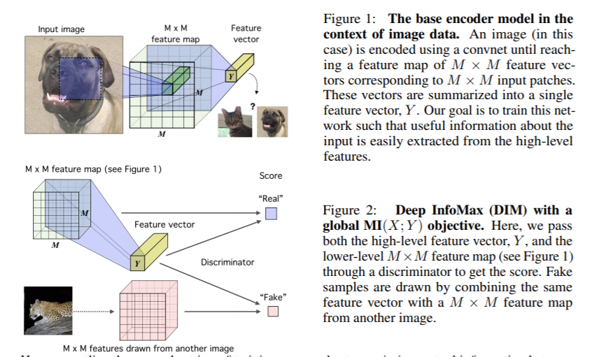

# 对比学习

它来了，它来了，对比学习携数据增强一起成团出道了，从CV到NLP都是妥妥的绝杀~当然了对比学习是在cv领域率先提出的，鉴于笔者平时偏好nlp领域，因此本文主要介绍对比学习在nlp领域的相关研究进展，附带一些经典的cv领域的额对比学习进展，毕竟LeCun，Bengio，Hinton和Kaiming这种巨巨巨。。。佬都是在cv领域神仙打架。

## 表示学习的发展

深度学习的一个重要的趋势是表示学习：Representation-Learning，学好了样本的表示可以直接用在一些不涉及逻辑、推理等的问题上，例如判断句子的情感极性、对图像进行目标检测（识别图像中包含哪些东西)。再例如文本领域从word2vec发展到bert等预训练模型，越来越多的工作都关注到表示学习上了。

对比学习的目的也是为了更好的学习样本的表示,那问题来了，样本表示是什么？[举个例子：contrative-self-supervised-learning](https://ankeshanand.com/blog/2020/01/26/contrative-self-supervised-learning.html)

>有人做了一个实验，要求画一张美元图，右图是真实的美元，左边是某人凭记忆画的美元图bulabula，
这个实验想表达的一个核心思想就是：尽管我们已经见过很多次钞票长什么样子，但我们很少能一模一样的画出钞票；虽然我们画不出栩栩如生的钞票，但我们依旧可以轻易地辨别出钞票。基于此，也就意味着表示学习算法并不一定要关注到样本的每一个细节，只要学到的特征能够使其和其他样本区别开来就行，这就是对比学习和对抗生成网络（GAN）的一个主要不同所在。[PaperWeekly](https://zhuanlan.zhihu.com/p/141141365)

所以表示学习不一定是学习到样本全局特征和局部特征，只要能学习到样本能够与其他的样本区分开的特征就行了。因此表示学习就是学习样本的主要特征而不是全部特征。

So~对比学习是在对比什么？

对比式学习着重于学习同类实例之间的共同特征，区分非同类实例之间的不同之处。让相似样本的距离更小，正负例样本之间的距离更大。

与生成式学习比较，对比式学习不需要关注实例上繁琐的细节，只需要在抽象语义级别的特征空间上学会对数据的区分即可，因此模型以及其优化变得更加简单，且泛化能力更强。

>Contrastive methods trained on unlabelled ImageNet data and evaluated with a linear classifier now surpass the accuracy of supervised AlexNet. They also exhibit significant data efficiency when learning from labelled data compared to purely supervised learning.

对比学习通过训练无label的ImageNet数据,评估线性分类器超过监督AlexNet的准确性。与纯粹的监督学习相比，当从标记数据学习时，它们也表现出显著的数据效率。
这里笔者直接给出一个结论：对比学习的核心思想是研究正样本和负样本在特征空间对比，从而更加充分的学习样本的特征表示，难点在于如何构造正负样本，对比学习是一种典型的无监督学习or自监督。

>对比学习是自监督学习的一种，也就是说，不依赖标注数据，要从无标注图像中自己学习知识。我们知道，自监督学习其实在图像领域里已经被探索了很久了。总体而言，图像领域里的自监督可以分为两种类型：生成式自监督学习，判别式自监督学习。VAE和GAN是生成式自监督学习的两类典型方法，即它要求模型重建图像或者图像的一部分，这类型的任务难度相对比较高，要求像素级的重构，中间的图像编码必须包含很多细节信息。对比学习则是典型的判别式自监督学习，相对生成式自监督学习，对比学习的任务难度要低一些。目前，对比学习貌似处于“无明确定义、有指导原则”的状态，它的指导原则是：“通过自动构造相似实例和不相似实例，要求习得一个表示学习模型，通过这个模型，使得相似的实例在投影空间中比较接近，而不相似的实例在投影空间中距离比较远”。而如何构造相似实例，以及不相似实例，如何构造能够遵循上述指导原则的表示学习模型结构，以及如何防止模型坍塌(Model Collapse)，这几个点是其中的关键。
目前出现的对比学习方法已有很多，如果从防止模型坍塌的不同方法角度，我们可大致把现有方法划分为：基于负例的对比学习方法、基于对比聚类的方法、基于不对称网络结构的方法，以及基于冗余消除损失函数的方法。除了介绍上述几种类型的对比学习模型外。

本文后面内容，还会回答下述两个问题：简单的介绍下当前cv和nlp存在的对比模型？目前的对比学习模型仍然存在哪些问题？[@]

## 对比学习损失函数的定义

从目标来说，在cv领域的对比学习就是要干NLP领域类似Bert预训练的事情，利用大量的无标注的数据，做预训练，然后在下游任务中做finetune。对比学习的本质是为了更好，更全面的学习样本表示的一个函数映射的关系，公式如下：

$\operatorname{score}\left(f(x), f\left(x^{+}\right)\right)>>\operatorname{score}\left(f(x), f\left(x^{-}\right)\right)$  (1)

>
- here $x^{+}$ is data point similar or congruent to $x$, referred to as a positive sample.
- $x^{-}$ is a data point dissimilar to $x$, referred to as a negative sample.
- the score function is a metric that measures the similarity between two features.

$x^{+}$是本$x4$相似的样本记为正例，$x^{-}$是和$x$不相似的样本记为负例。score（向量内积）是衡量两个样本的相似度。因此这个公式也非常好理解：相似样本的距离要远远大于不相似样本的距离。

>This is the familiar cross-entropy loss for an $N$-way softmax classifier, and commonly called the InfoNCE loss in the contrastive learning literature. It has been referred to as multi-class n-pair loss and ranking-based NCE in previous works.
The InfoNCE objective is also connected to mutual information. Specifically, minimizing the InfoNCE loss maximizes a lower bound on the mutual information between $f(X)$ and $f\left(X^{+}\right)$. See Poole et al., 2019 for a derivation and more details on this bound.

$\mathcal{L}_{N}=-\mathbb{E}_{X}\left[\log \frac{\overline{\exp \left(f(x)^{T} f\left(x^{+}\right)\right)}}{\exp \left(f(x)^{T} f\left(x^{+}\right)\right)+\sum_{j=1}^{N-1} \exp \left(f(x)^{T} f\left(x_{j}\right)\right)}\right]$   (2)

公式2就是待优化的loss，通过二者互信息来衡量二者距离/相似度，可逼近其下界。对于x，分母项有1个正例和$N-1$个负例，那么这个loss就可以看做是一个N分类问题, 实际上就是一个交叉嫡, 而这个函数在对比学习的文章(下文中的cpc)中也叫InfoNCE loss。事实上, 最小化这一loss能够最大化$f(x)$和 $f\left(x^{+}\right)$互信息(衡量随机变量之间的依赖关系)的下界，让二者的表示更为接近。这个loss函数的分子部分鼓励正例相似度越高越好，也就是在表示空间内距离越近越好；而分母部分，则鼓励任意负例之间的向量相似度越低越好，也就是距离越远越好。这样，在优化过程中，通过InfoNCE损失函数指引，就能训练模型，以达成我们期望的目标。

## DIM

说到互信息估计，论文[Learning deep representations by mutual information estimation and maximization](https://arxiv.org/pdf/1808.06670.pdf)中提出了DeepInfoMax算法（DIM），通过利用图像中存在的局部结构来学习图像表示。DIM的对比任务是区分全局特征和局部特征是否来自同一图像。全局特征是卷积编码器的最终输出(一个平面向量，Y)，局部特征是编码器的一个中间层的输出(一个$MxM$维度的特征映射)。每个局部特征图都有一个有限的接受域。

在预测未来信息时, 我们将目标x (预测) 和上下文c (已知) 编码成一个紧奏的分布式 向量表示(通过非线性学习映射)，其方式最大限度地保留了定义为的原始信号\times和c的互信息

$$
I(x, c)=\sum_{x} \sum_{c} p(x, c) \log \frac{p(x, c)}{p(x) p(c)}=\sum_{x, c} p(x, c) \log \frac{p(x \mid c)}{p(x)}
$$

通过最大化编码之间互信息(它以输入信号之间的MI为界)，提取输入中的隐变量。 互信息往往是算不出来的，但是我们这里将他进行估计，通过不同方法进行估计，从而 衍生出自监督的两种方式: 生成式和对比式互信息上界估计：减少互信息，即VAE的目标。 互信息下界估计：增加互信息, 即对比学习 (CL) 的目标。 [后来也有CLUB上界估计 和下界估计一起使用的对比学习。）

因此，直观地说，这意味着要做好对比任务，全局特征向量必须从所有不同的局部区域捕获信息。详细内容可以看论文，笔者这里不展开。但是给出原文中学习特征映射的图。

## cpc

论文标题：Representation Learning with Contrastive Predictive Coding
论文链接：arxiv.org/abs/1807.0374
代码链接：github.com/davidtellez/

另一篇文章[Representation Learning with
Contrastive Predictive Coding](https://arxiv.org/pdf/1807.03748.pdf)对比预测编码(CPC)是一种对比方法，可以应用于任何形式的数据，可以用有序序列表示:文本、语音、视频，甚至图像(图像可以被视为像素或补丁的序列)。CPC通过编码多个时间间隔的数据点共享的信息来学习表示，丢弃局部特征，这些被丢弃的特征也叫慢特征:随着时间的推移变化不会太快的特征（与时间序列有关）。示例包括音频信号中讲话者的身份、视频中进行的活动、图像中的对象等。下图就是cpc的具体过程

$c_t$ 这里的定义其实就是infoNCE

CPC可以利用一定窗口内的$x_{t}$和 $x_{t+k}$ 作为 Positive pair, 并从输入序列之中随机采样一个输入 $x_{t *}$ 作为负例。为了把历史的信息也加入进去，作者提出可以在 $z_{t}$ 上额外增加一个自递归模型，例如 $\mathrm{GRU}$, 在表示之中融入时序关系，得到相应的 $c_{t}$ 来进行对比学习。在下游任务中, 既可以使用 $z_{t}$ 也可以使用$c_{t}$, 又或者是二者的融合, 可以根据任务需要来进行灵活的选择。

## moco

论文标题：Momentum Contrast for Unsupervised Visual Representation Learning
论文链接：arxiv.org/abs/1911.0572
代码链接：github.com/facebookrese

另一篇何凯明大神的[moco]()https://arxiv.org/abs/1911.05722模型提出动量对比学习Momentum Contrast: kaiming 大神用momentum的思想很提出动量对比度（MoCo）用于无监督的视觉表示学习。 从作为字典查找的对比学习的角度来看，我们构建了一个带有队列和移动平均编码器的动态字典。 这样就可以实时构建大型且一致的词典，从而促进对比性的无监督学习。MoCo在ImageNet分类的通用线性协议下提供了竞争性的结果。 更重要的是，MoCo学习到的表示将转移到下游任务。 MoCo可以胜过在PASCAL VOC，COCO和其他数据集上进行监督的预训练对等任务中的检测/细分任务，有时会大大超过它。 这表明在许多视觉任务中，无监督和有监督的表征学习之间的鸿沟已被大大消除。从而使得模型在学习的过程中避免学习classifier weights 和memory bank，同时又保证可以handle大规模的数据！其中的shuffle batch normalization 应该也是进一步稳定这个training过程的一个很重要的trick。

## simcCLR

论文标题：A Simple Framework for Contrastive Learning of Visual Representations
论文链接：arxiv.org/abs/2002.0570
代码链接：github.com/google-resea

MoCo刚说完样本数量对于对比学习很重要，这边SimCLR就从另外一个角度，说构建负例的方式（图像上，就是对于图像的 transformation）也很重要，探究了transformation 、batch-size 大小等对于学习到的表示的影响。结论是batch-size越大越好。SimCLR是典型的基于负例的对比学习，通过数据增强得到的图像。对于某张图片 $\boldsymbol{x}$, 我们从可能的增强操作集合J中，随机抽取两种: $\boldsymbol{t}_{\mathbf{1}} \sim \mathcal{T}$ 及 $t_{2} \sim \mathcal{T}$, 分别作用在原始图像上，形成两张经过增强的新图像 $\left\langle\mathbf{x}_{\mathbf{1}} \square \mathbf{x}_{\mathbf{2}}\right\rangle$, 两者互为正例。训练时，Batch
内任意其它图像，都可做为 $x_{1 或} X_{2}$ 的负例。这样，对比学习希望习得某个表示模型，它能够将图片映射到
某个投影空间，并在这个空间内拉近正例的距离，推远负例距离。也就是说，迫使表示模型能够忽略表面
因素，学习图像的内在一致结构信息，即学会某些类型的不变性，比如遮挡不变性、旋转不变性、颜色不
变性等。SimCLR证明了，如果能够同时融合多种图像增强操作，增加对比学习模型任务难度，对于对比学
习效果有明显提升作用。

那在NLP领域，不得不吹爆陈丹奇的SIMCSE,一个dropout，完虐一众文本表示的研究！

这不得不从sentence-embedding讲起：Sentence Embeddings：即能表征句子语义的特征向量，获取这种特征向量的方法有无监督和有监督两种，在无监督学习中，我们首先会考虑利用预训练好的大型预训练模型获取[CLS]或对句子序列纬度做MeanPooling来得到一个输入句子的特征向量。

>
但这种方法被证明了有一个致命的缺点即： Anisotropy(各向异性)

- language models trained with tied input/output embeddings lead to anisotropic word embeddings. 通俗来说就是在我们熟悉的预训练模型训练过程中会导致word-embeddings的各维度的特征表示不一致。导致我们获取的句子级别的特征向量也无法进行直接比较。

目前比较流行解决这一问题的方法有：

- 线性变换：bert-flow 或 bert-whitening，无论是在bert中增加flow层还是对得到句子向量矩阵进行白化其本质都是通过一个线性变换来缓解Anisotropy。

- 对比学习：先对句子进行传统的文本增广，如转译、删除、插入、调换顺序等等，再将一个句子通过两次增广得到的新句子作为正样本对，取其他句子的增广作为负样本，进行对比学习，模型的目标也很简单，即拉近正样本对的embeddings，同时增加与负样本的距离。

- SimCSE: Simple Contrastive Learning of Sentence Embeddings，发现利用预训练模型中自带的Dropout mask作为“数据增强的手段”得到的Sentence-Embeddings，其质量远好于传统的数据增强方法，其无监督和有监督方法无监督语义上达到SOTA。

## simcse

论文题目：SimCSE: Simple Contrastive Learning of Sentence Embeddings
论文链接：https://arxiv.org/abs/2104.08821
论文代码：https://github.com/princeton-nlp/SimCSE

这里给出原文中对有监督和无监督的论述。

>Our unsupervised SimCSE simply predicts the input sentence itself, with only dropout (Srivastava et al., 2014) used as noise (Figure $1(a))$. In other words, we pass the same input sentence to the pretrained encoder twice and obtain two embeddings as "positive pairs", by applying independently sampled dropout masks. Although it may appear strikingly simple, we find that this approach largely outperforms training objectives such as predicting next sentences (Kiros et al., 2015; Logeswaran and Lee,2018) and common data augmentation techniques,e.g., word deletion and replacement. More surprisingly, this unsupervised embedding method already matches all the previous supervised approaches. Through careful analysis, we find that dropout essentially acts as minimal data augmentation, while removing it leads to a representation collapse.

可以简单的理解为在原有无监督预训练中增加了dropout作为数据增强的方法，模型效果明显提升

## 参考文献

博客参考
[a]ankeshanand.com/blog/20
[b]Lethe：Noise Contrastive Estimation 前世今生——从 NCE 到 InfoNCE
[c]得未曾有：理解Contrastive Predictive Coding和NCE Loss
[d]hahakity：Moco 文章阅读笔记
[e]极光无限：无监督学习之对比学习
[f]BBuf：【损失函数合集】Contrastive Loss 和 Triplet Loss
[g]宋文乐：深度学习中的互信息量上下界估计
[h]军火交易商：详解对比损失（contrastive loss）与交叉熵损失（cross-entropy）的关系
[i]PaperWeekly：深度学习中的互信息：无监督提取特征
[j]自监督、半监督和有监督全涵盖，四篇论文遍历对比学习的研究进展

