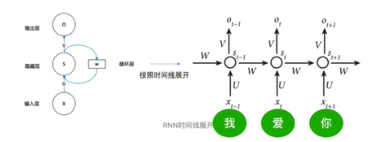
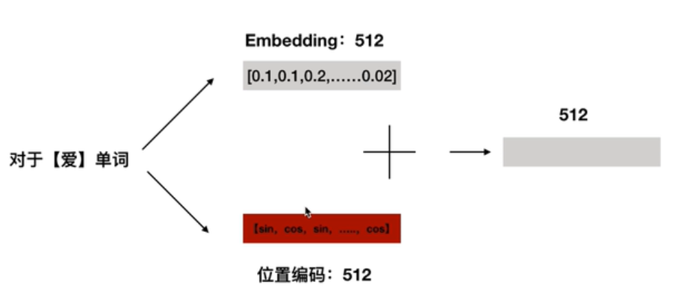
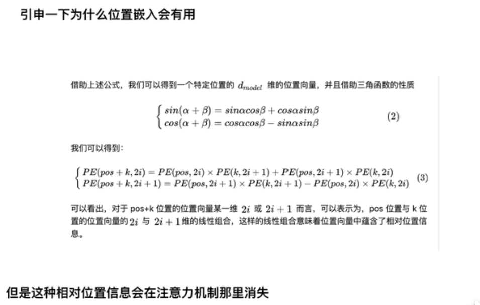
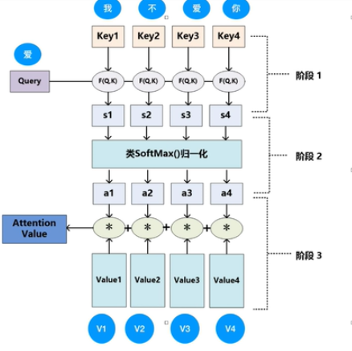
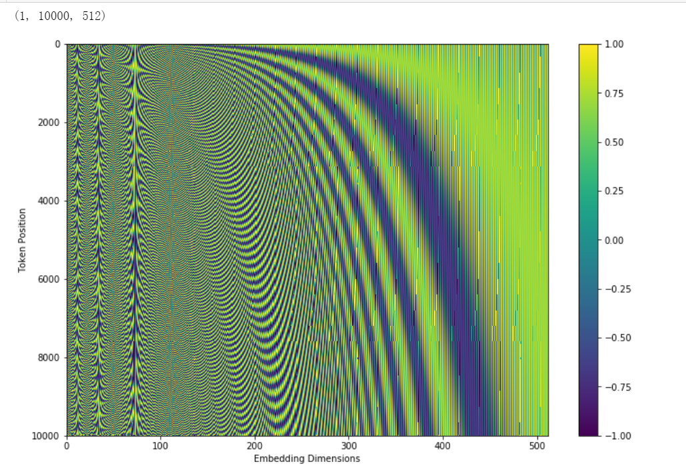

## Attention is all you need


### introduction

> the Transformer,based solely on attention mechanisms, dispensing with
> recurrence and convolutions entirely.[@2017Attention]

transformer只依靠attention机制，舍弃了之前的rnn和cnn的结构

> Our model achieves 28.4 BLEU on the WMT 2014 English-to-German
> translation task, improving over the existing best results, including
> ensembles, by over 2 BLEU. On the WMT 2014 English-to-French
> translation task,our model establishes a new single-model
> state-of-the-art BLEU score of 41.8 after training for 3.5 days on
> eight GPUs, a small fraction of the training costs of the best models
> from the literature.

非常的消耗算力，因此后面的很多学者研究模型压缩

> Recurrent models typically factor computation along the symbol
> positions of the input and output sequences. Aligning the positions to
> steps in computation time, they generate a sequence of hidden states
> $h_{t},$ as a function of the previous hidden state $h_{t-1}$ and the
> input for position $t .$ This inherently sequential nature precludes
> parallelization within training examples, which becomes critical at
> longer sequence lengths, as memory constraints limit batching across
> examples.

RNN的$h_t$是同时接受$x_t$和$h_{t-1}$的影响的

但是RNN相关算法只能从左向右依次计算或者从右向左依次计算缺少全局的依赖
但是还是短距离依赖，没法解决梯度消失，长距离依赖的问题
因此出现了lstm和gru

> Attention mechanisms have become an integral part of compelling
> sequence modeling and transduction models in various tasks, allowing
> modeling of dependencies without regard to their distance in the input
> or output sequences .

attention在序列模型传导机制中允许对依赖项进行建模而**无需考虑它们之间的输入距离或输出序列**

> The goal of reducing sequential computation also forms the foundation
> of the Extended Neural GPU \|16], ByteNet [18] and ConvS2S [9], all of
> which use convolutional neural networks as basic building block,
> computing hidden representations in parallel for all input and output
> positions. In these models, the number of operations required to
> relate signals from two arbitrary input or output positions grows in
> the distance between positions, linearly for ConvS2S and
> logarithmically for ByteNet. This makes it more difficult to learn
> dependencies between distant positions $[12] .$ In the Transformer
> this is reduced to a constant number of operations, albeit at the cost
> of reduced effective resolution due to averaging attention-weighted
> positions, an effect we counteract with Multi-Head Attention

前人的研究有使用卷积神经进行序列建模建立block结构（卷积核？）并行计算所有输入和输出位置的隐藏表示，在这些模型中，关联来自两个任意输入或输出位置的信号所需的操作数随位置之间的距离而增加，对于ConvS2S的参数呈线性增长，而对于ByteNet参数则对数增长。
这使得学习远位置之间的依赖关系变得更加困难。

在Transformer中，将参数减少到一个固定的维度，尽管这是由于平均注意力加权位置而导致有效分辨率降低的结果，可以使用多头注意力抵消这种影响


> Self-attention, sometimes called intra-attention is an attention
> mechanism relating different positions of a single sequence in order
> to compute a representation of the sequence.

自我注意（有时称为内部注意）是一种**与单个序列的不同位置相关的注意力机制**，目的是计算序列的表示形式。

这里看下之前的注意力机制的讲解[attention](https://www.cnblogs.com/gaowenxingxing/p/12674810.html)

> Transformer is the first transduction model relying entirely on
> self-attention to compute representations of its input and output
> without using sequencealigned RNNs or convolution.

Transformer是第一个完全依靠自我注意力来计算其输入和输出表示的转导模型，而无需使用序列对齐的RNN或卷积

> The Transformer follows this overall architecture using stacked
> self-attention and point-wise, fully connected layers for both the
> encoder and decoder, shown in the left and right halves of Figure
> 1,respectively.

下面这个图是TRM模型的完整的结构，N个encoder和N个decoderz组成


本篇文章重点应用在机器翻译的领域，因此一个形象的例子是[@DASOU]


鉴于这个文章写的内容板块比较乱，就不按照文章的顺序了

### input


第一部分是输入层，从图来看是两部分组成的，包括一个token embedding和一个positional encoding两部分做求和作为input。

token embedding就是w2VEC训练出来的词向量，每个词向量的维度是512，这个很常规。TRM并没有使用RNN这种序列网络，而是使用的self-attention这种结构。

>Since our model contains no recurrence and no convolution, in order for the model to make use of the order of the sequence, we must inject some information about the relative or absolute position of the tokens in the sequence. To this end, we add "positional encodings" to the input embeddings at the bottoms of the encoder and decoder stacks. The positional encodings have the same dimension $d_{\text {model }}$ as the embeddings, so that the two can be summed. There are many choices of positional encodings, learned and fixed [9].
In this work, we use sine and cosine functions of different frequencies: 

RNN处理的是序列的特征，是有先后顺序的，例如"我爱你"这个序列，RNN的处理方式是先处理我，然后再根据"我"的信息处理"爱"等等，RNN中的每个time step是共享U,W,V的。



但是transformer不一样，transformer是对每个字/词做并行训练的，可以同时处理，这样的好处是加快了速度，因此transformer就缺少告诉一个序列谁前谁后的一个方法，此时有了位置编码

两种Positional Encoding方法：


$$
\begin{aligned}
P E_{(p o s, 2 i)} &=\sin \left(p o s / 10000^{2 i / d_{\text {model }}}\right) \\
P E_{(p o s, 2 i+1)} &=\cos \left(p o s / 10000^{2 i / d_{\text {model }}}\right)
\end{aligned}
$$

在512维度中，$2i$表示偶数位置使用的是$sin$,$2i+1$表示奇数位置使用cos,也就是下图


得到位置编码后，将词向量的512维度的tokenembedding和位置向量的512维度的embedding相加，得到最终的512维度作为整个transformer的input。




sin,cos体现的绝对的位置编码，这里我其实没太懂这个，绝对位置编码中有相对位置编码的表示。

- [ ] 为什么位置编码有用？



> 任意位置的 $PE_{pos+k}$都可以被$PE_{pos}$的线性函数表示。考虑到在NLP任务中，除了单词的绝对位置，单词的相对位置也非常重要。根据公式
> $sin(\alpha+\beta) = sin \alpha cos \beta + cos \alpha sin\beta 以及cos(\alpha + \beta) = cos \alpha cos \beta - sin \alpha sin\beta，$这表明位置
> $k+p$的位置向量可以表示为位置 k
> 的特征向量的线性变化，这为模型捕捉单词之间的相对位置关系提供了非常大的便利。


### encoder

> **encoder**: The encoder is composed of a stack of $N=6$ identical
> layers. Each layer has two sub-layers. The first is a multi-head
> self-attention mechanism, and the second is a simple, positionwise
> fully connected feed-forward network. We employ a residual connection
> [11] around each of the two sub-layers, followed by layer
> normalization [1]. That is, the output of each sub-layer is LayerNorm
> $(x+$ Sublayer $(x)),$ where Sublayer $(x)$ is the function
> implemented by the sub-layer itself. To facilitate these residual
> connections, all sub-layers in the model, as well as the embedding
> layers, produce outputs of dimension $d_{\text {model }}=512$.

encoder部分是由6个相同的堆网络层组成的，每一层有2个子网络：第一个子网络是多头注意力和自注意力机制，第二个子网络是一个位置全连接前馈神经网络

6个encoder是一模一样的结构，但是参数并不共享，训练的时候6个encoder是同时巡训练的，参数是独立的，不共享

后面albert做改进的时候参数是共享的，因此来减少参数的量级。6个decoder的结构是完全相同的，但是encoder和decoder是完全不同的


### self-attention

>Instead of performing a single attention function with $d_{\text {model }}$ -dimensional keys, values and queries, we found it beneficial to linearly project the queries, keys and values $h$ times with different, learned linear projections to $d_{k}, d_{k}$ and $d_{v}$ dimensions, respectively. On each of these projected versions of queries, keys and values we then perform the attention function in parallel, yielding $d_{v}$ -dimensional output values. These are concatenated and once again projected, resulting in the final values, as depicted in Figure 2.


> An attention function can be described as mapping a query and a set of
> key-value pairs to an output,where the query, keys, values, and output
> are all vectors. The output is computed as a weighted sum of the
> values, where the weight assigned to each value is computed by a
> compatibility function of the query with the corresponding key

attention可以描述为将查询和一组键值对映射到输出，其中查询，键，值和输出都是向量。
**将输出计算为值的加权总和，其中分配给每个值的权重是通过查询与相应键的兼容性函数来计算**

> In practice, we compute the attention function on a set of queries
> simultaneously, packed together into a matrix $Q .$ The keys and
> values are also packed together into matrices $K$ and $V$. We compute
> the matrix of outputs as:

普通的注意力的得分怎么算？可以借鉴一个图


$$
\operatorname{Attention}(Q, K, V)=\operatorname{softmax}\left(\frac{Q K^{T}}{\sqrt{d_{k}}}\right) V
$$




> The two most commonly used attention functions are additive attention
> [2], and dot-product (multiplicative) attention. Dot-product attention
> is identical to our algorithm, except for the scaling factor of
> $\frac{1}{\sqrt{d_{k}}} .$ Additive attention computes the
> compatibility function using a feed-forward network with a single
> hidden layer. While the two are similar in theoretical complexity,
> dot-product attention is much faster and more space-efficient in
> practice, since it can be implemented using highly optimized matrix
> multiplication code.

计算attention的方式有2种，一种是点积的形式，另一种是求和的形式这里可以看下参考文献2，transformer中用的是点积的形式，此外还多了一个标准化的$\frac{1}{\sqrt{d_{k}}}$
求和形式的注意力使用具有单个隐藏层的前馈网络来计算兼容性函数.实际中点积形式的会更快更省内存。


> While for small values of $d_{k}$ the two mechanisms perform
> similarly, additive attention outperforms dot product attention
> without scaling for larger values of $d_{k}[3] .$ We suspect that for
> large values of $d_{k},$ the dot products grow large in magnitude,
> pushing the softmax function into regions where it has extremely small
> gradients ${ }^{4} .$ To counteract this effect, we scale the dot
> products by $\frac{1}{\sqrt{d_{k}}}$

虽然对于$ d\_ {k} $较小的，这两种机制的执行方式相似，但是对于$ d_ {k}$
较大的，加法注意的性能优于点积注意，而无需缩放。我们怀疑对于$d_{k}$的较大，点积的幅度增大，将softmax函数推入梯度极小的区域。为了抵消这种影响，用$\frac{1}{\sqrt{d_{k}}}$

### Multi-head attention


查询,键值分别对应Q,K,V三个矩阵，因此attention的矩阵运算如下

Multi-head attention allows the model to jointly attend to information from different representation subspaces at different positions. With a single attention head, averaging inhibits this.

$$
\begin{aligned}
\text { MultiHead }(Q, K, V) &=\text { Concat }\left(\text { head }_{1}, \ldots, \text { head }_{\mathrm{h}}\right) W^{O} \\
\text { where head }_{\mathrm{i}} &=\operatorname{Attention}\left(Q W_{i}^{Q}, K W_{i}^{K}, V W_{i}^{V}\right)
\end{aligned}
$$

这个公式中并没有解释Q,K,V是怎样得到的，[jay alammar](https://jalammar.github.io/illustrated-transformer/)的这篇解析中解释的很详细其实就是给三个矩阵$W^{Q}$,$ W^{K}$, $W^{V}$，然后用每个字向量去乘矩阵得到的。
截个图来


Where the projections are parameter matrices $W_{i}^{Q} \in \mathbb{R}^{d_{\text {model }} \times d_{k}}, W_{i}^{K} \in \mathbb{R}^{d_{\text {model }} \times d_{k}}, W_{i}^{V} \in \mathbb{R}^{d_{\text {model }} \times d_{v}}$ and $W^{O} \in \mathbb{R}^{h d_{v} \times d_{\text {model }}}$
In this work we employ $h=8$ parallel attention layers, or heads. For each of these we use $d_{k}=d_{v}=d_{\text {model }} / h=64 .$ Due to the reduced dimension of each head, the total computational cost is similar to that of single-head attention with full dimensionality.

Q,K,V每个矩阵的维度是一样的是512*64,面试中问到了。注意力头数是8.


### 残差网络的结构

为了使网络层变变深，并且缓解梯度消失。


这里推到下resnet为什么能缓解梯度消失?


### LN

因为BN效果差，有一个说法，BN在NLP任务中用到的少，一般都是LN,具体原因可以查一下feature scaling


### decoder

> **Decoder:** The decoder is also composed of a stack of $N=6$
> identical layers. In addition to the two sub-layers in each encoder
> layer, the decoder inserts a third sub-layer, which performs
> multi-head attention over the output of the encoder stack. Similar to
> the encoder, we employ residual connections around each of the
> sub-layers, followed by layer normalization.

decoder部分也是由6个相同的块结构组成，除了每个编码器层中的两个子层之外，解码器还插入一个第三子层，该子层对编码器堆栈的输出执行多头关注，在每个sub-layers之间同样使用了残差神经网络。DECODER部分是产生Q的

> We also modify the self-attention sub-layer in the decoder stack to
> prevent positions from attending to subsequent positions. This
> masking, combined with fact that the output embeddings are offset by
> one position, ensures that the predictions for position $i$ can depend
> only on the known outputs at positions less than $i$.

修改了解码器堆栈中的自我注意子层，以防止位置关注后续位置。
这种掩盖，加上输出嵌入被一个位置偏移的事实，确保了对位置$ i$的预测只能依赖于位置小于$ i$的已知输出。(这里感觉用到了HMM的齐次一阶马尔可夫？）


> Transformer注意力机制有效的解释：Transformer所使用的注意力机制的核心思想是去计算一句话中的每个词对于这句话中所有词的相互关系，然后认为这些词与词之间的相互关系在一定程度上反应了这句话中不同词之间的关联性以及重要程度。因此再利用这些相互关系来调整每个词的重要性（权重）就可以获得每个词新的表达。这个新的表征不但蕴含了该词本身，还蕴含了其他词与这个词的关系，**因此和单纯的词向量相比是一个更加全局的表达**。使用了Attention机制，将序列中的任意两个位置之间的距离缩小为一个常量。
> Attention之后还有一个线性的dense层，即multi-head
> attention_output经过一个hidden_size为768的dense层，然后对hidden层进行dropout，最后加上resnet并进行normalization（tensor的最后一维，即feature维进行）。


OOV就是out-of-vocabulary，不在词库里的意思。

- 新词产生，这个问题的解决方式？


RNN的梯度消失和普通梯度消失有什么不一样？

RNN的梯度是
一个总的梯度和，它的梯度消失并不是变为零，总梯度被近距离的梯度主导，远距离梯度忽略不计


to do:

- [ ] transfomer 中的sin,cos的相对位置编码每个位置编码的分量存在周期变化，对位置编码向量产生的影响不大。

- [ ] QKV,有没有都存在的必要？

一部分人说是有，一部分人说是无。


TRM中的PE实现？

```r
# coding=utf-8
import numpy as np
import matplotlib.pyplot as plt
# Code from https://www.tensorflow.org/tutorials/text/transformer
def get_angles(pos, i, d_model):
    angle_rates = 1 / np.power(10000, (2 * (i//2)) / np.float32(d_model))
    return pos * angle_rates

def positional_encoding(position, d_model):
    angle_rads = get_angles(np.arange(position)[:, np.newaxis],
                            np.arange(d_model)[np.newaxis, :],
                            d_model)

    # apply sin to even indices in the array; 2i
    angle_rads[:, 0::2] = np.sin(angle_rads[:, 0::2])

    # apply cos to odd indices in the array; 2i+1
    angle_rads[:, 1::2] = np.cos(angle_rads[:, 1::2])

    pos_encoding = angle_rads[np.newaxis, ...]

    return pos_encoding
if __name__ == '__main__':
    tokens = 10000 #sequence length
    dimensions = 512

    pos_encoding = positional_encoding(tokens, dimensions)
    print (pos_encoding.shape)

    plt.figure(figsize=(12,8))
    plt.pcolormesh(pos_encoding[0], cmap='viridis')
    plt.xlabel('Embedding Dimensions')
    plt.xlim((0, dimensions))
    plt.ylim((tokens,0))
    plt.ylabel('Token Position')
    plt.colorbar()
    plt.show()
```

