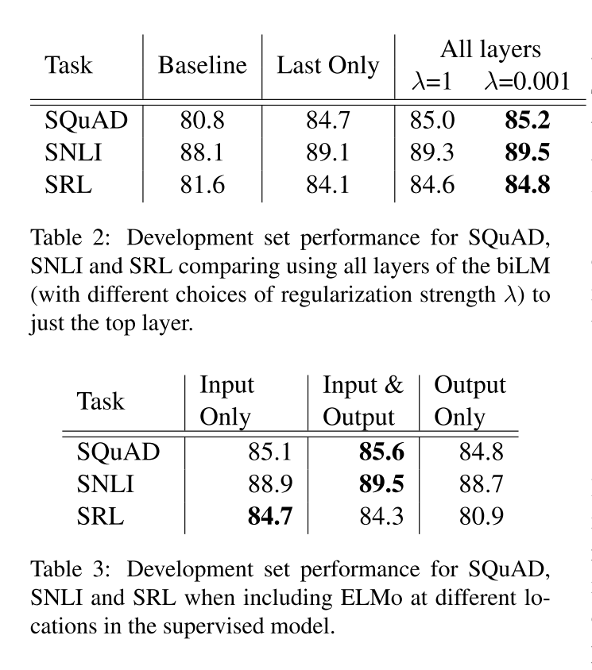

# NLP paper preview

emmmmm...站在巨人的肩膀看世界\~ 是件幸福的事情


## word2vec

这个工具包毕竟是梯子级别的~
主要包括两个方法CBOW和SKIP-gram

### CBOW

Continuous Bag-of-Words 连续词袋模型

目标函数

$$
\begin{array}{c}
\frac{1}{T} \sum_{t=1}^{T} \log P\left(w_{t} \mid c_{t}\right) \\
P\left(w_{t} \mid c_{t}\right)=\frac{\exp \left(e^{\prime}\left(w_{t}\right)^{T} x\right)}{\sum_{i=1}^{|V|} \exp \left(e^{\prime}\left(w_{i}\right)^{T} x\right)}, x=\sum_{i \in c} e\left(w_{i}\right)
\end{array}
$$

>CBOW没有隐藏层，本质上只有两层结构，输入层将目标词语境c中的每一个词向量简单求和（当然，也可以求平均）后得到语境向量，然后直接与目标词的输出向量求点积，目标函数也就是要让这个与目标词向量的点积取得最大值，对应的与非目标词的点积尽量取得最小值。从这可以看出，CBOW的第一个特点是取消了NNLM中的隐藏层，直接将输入层和输出层相连；第二个特点便是在求语境context向量时候，语境内的词序已经丢弃（这个是名字中Continuous的来源）；第三，因为最终的目标函数仍然是语言模型的目标函数，所以需要顺序遍历语料中的每一个词（这个是名字中Bag-of-Words的来源）。因此有了这些特点（尤其是第二点和第三点），Mikolov才把这个简单的模型取名叫做CBOW，简单却有效的典范。
需要注意的是这里每个词对应到两个词向量, 在上面的公式中都有体现, 其中 $e\left(w_{t}\right)$ 是词的输入 向量, 而 $e^{\prime}\left(w_{t}\right)$ 则是词的输出向量, 或者更准确的来讲, 前者是CBOW输入层中跟词 $w_{t}$ 所在 位置相连的所有边的权值 (其实这就是词向量) 组合成的向量, 而是输出层中与词 $w_{t}$ 所在位置 相连的所有边的权值组合成的向量, 所以把这一向量叫做输出向量。


### skip-gram

同样地, 和CBOW对应, Skip-gram的模型基本思想和CBOW非常类似, 只是换了一个方向： CBOW是让目标词的输出向量 $e^{\prime}\left(w_{t}\right)$ 拟合语境的向量 $x$; 而Skip-gram则是让语境中每个词 的输出向量尽量拟合当前输入词的向量 $e\left(w_{t}\right),$ 和CBOW的方向相反, 因此它的目标函数如下：

$$
\begin{array}{c}
\frac{1}{T} \sum_{t=1}^{T} \sum_{j \in c} \log P\left(w_{j} \mid w_{t}\right) \\
P\left(w_{j} \mid w_{t}\right)=\frac{\exp \left(e^{\prime}\left(w_{j}\right)^{T} e\left(w_{t}\right)\right)}{\sum_{i=1}^{|V|} \exp \left(e^{\prime}\left(w_{i}\right)^{T} e\left(w_{t}\right)\right)}
\end{array}
$$

可以看出目标函数中有两个求和符号, 最里面的求和符号的意义便是让当前的输入词分别和该词对 应语境中的每一个词都尽量接近, 从而便可以表现为该词与其上下文尽量接近。


CBOW和skip-gram的两个目标函数是需要记得的，但是也要记得如果这么计算，去遍历每个词，那么一旦涉及大量的文本任务，其计算量会非常的大~

因此有了优化算法Hierachical Softmax和负采样。前者是霍夫曼树的思想。后者具体解释下~

负采样思想也是受了C\&W模型中构造负样本方法启发, 同时参考了Noise Contrastive Estimation (NCE)的思想, 用CBOW的框架简单来讲就是, 负采样 每遍历到一个目标词, 为了使得目标词的概率 $P\left(w_{t} \mid c_{t}\right)$ 最大，根据softmax函数的概率公式, 也 就是让分子中的 $e^{\prime}\left(w_{t}\right)^{T} x$ 最大, 而分母中其他非目标词的 $e^{\prime}\left(w_{i}\right)^{T} x$ 最小, 普通softmax的 计算量太大就是因为它把词典中所有其他非目标词都当做负例了，而负采样的思想特别简单，就是 每次按照一定概率随机采样一些词当做负例，从而就只需要计算这些负采样出来的负例了，那么概 率公式便相应变为

$$
P\left(w_{t} \mid c_{t}\right)=\frac{\exp \left(e^{\prime}\left(w_{t}\right)^{T} x\right)}{\sum_{i=1}^{K} \exp \left(e^{\prime}\left(w_{i}\right)^{T} x\right)}, x=\sum_{i \in c} e\left(w_{i}\right)
$$
仔细和普通softmax进行比较便会发现，将原来的|V|分类问题变成了K分类问题, 这便把词典大小 对时间复杂度的影响变成了一个常数项, 而改动又非常的微小，不可谓不巧妙。

非常的巧妙~

跳词模型也有非常多的变形~后面的skip-thoughts就源于此

## fasttext

结构中比较重要的几个点

### Hierarchical softmax

这个没什么好说的，和word2vec里面的是一样的。具体解释忘记之前从哪里找来得了但私以为解释的8错

> When the number of classes is large, computing the linear classifier
> is computationally expensive. More precisely, the computational
> complexity is $O(k h)$ where $k$ is the number of classes and $h$ the
> dimension of the text representation. In order to improve our running
> time, we use a hierarchical softmax (Goodman, 2001) based on the
> Huffman coding tree (Mikolov et al., 2013 ). During training, the
> computational complexity drops to $O\left(h \log _{2}(k)\right)$. The
> hierarchical softmax is also advantageous at test time when searching
> for the most likely class. Each node is associated with a probability
> that is the probability of the path from the root to that node. If the
> node is at depth $l+1$ with parents $n_{1}, \ldots, n_{l},$ its
> probability is $$
> P\left(n_{l+1}\right)=\prod_{i=1}^{l} P\left(n_{i}\right)
> $$

> This means that the probability of a node is always lower than the one
> of its parent. Exploring the tree with a depth first search and
> tracking the maximum probability among the leaves allows us to discard
> any branch associated with a small probability. In practice, we
> observe a reduction of the complexity to
> $O\left(h \log _{2}(k)\right)$ at test time. This approach is further
> extended to compute the $T$ -top targets at the cost of $O(\log (T)),$
> using a binary heap.

主要就是利用霍夫曼树加快计算的速度

> Hierachical
> Softmax的基本思想就是首先将词典中的每个词按照词频大小构建出一棵Huffman树,
> 保证词频较大的词处于相对比较浅的层,
> 词频较低的词相应的处于Huffman树较深层的叶子节点,
> 每一个词都处于这棵Huffman树上的某个叶子节点;
> 第二，将原本的一个\|V\|分类问题变成了$\log|V|$ 次的二分类问题,
> 做法简单说来就是, 原先要计算 $P\left(w_{t} \mid c_{t}\right)$的时候,
> 因为使用的 是普通的softmax,
> 势必要求词典中的每一个词的概率大小，为了减少这一步的计算量, 在
> Hierachical Softmax中，同样是计算当前词 $w_{t}$
> 在其上下文中的概率大小，只需要把它变成在
> Huffman树中的路径预测问题就可以了，因为当前词 $w_{t}$
> 在Huffman树中对应到一条路径, 这条 路径由这棵二叉树中从根节点开始,
> 经过一系列中间的父节点, 最终到达当前这个词的叶子节点而 组成,
> 那么在每一个父节点上，都对应的是一个二分类问题（本质上就是一个LR分类器），而
> Huffman树的构造过程保证了树的深度为 $\log |V|,$
> 所以也就只需要做$\log |V|$次二分类便可以 求得
> $P\left(w_{t} \mid c_{t}\right)$ 的大小, 这相比原来\|V\|次的计算量,
> 已经大大减小了。

### N\_gram features

**这个是主要区别于word2vec的输入的部分了，为了更好的学习到上下文的语序特征**

从bag of word 变成了bag of features

> Bag of words is invariant to word order but taking explicitly this
> order into account is often computationally very expensive. Instead,
> we use a bag of n-grams as additional features to capture some partial
> information about the local word order. This is very efficient in
> practice while achieving comparable results to methods that explicitly
> use the order (Wang and Manning, 2012 ). We maintain a fast and memory
> efficient mapping of the n-grams by using the hashing trick
> (Weinberger et al., 2009 ) with the same hashing function as in
> Mikolov et al. (2011) and $10 \mathrm{M}$ bins if we only used
> bigrams, and $100 \mathrm{M}$ otherwise.

-   [ ] fasttext 文本分类的结构？

### fasttext与word2vec对比

感觉读paper的时候并没有很仔细的找出fasttext和word2vec的区别

> word2vec和GloVe都不需要人工标记的监督数据，只需要语言内部存在的监督信号即可以完成训练。而与此相对应的，fastText则是利用带有监督标记的文本分类数据完成训练，本质上没有什么特殊的，模型框架就是CBOW。

因为是训练词向量的嘛，因此只需要文本就可以了，不需要标签。

fasttext和word2vec本质无区别都是单层的神经网络，CBOW的结构，通过上下文预测当前词。
word2vec是为了得到embedding的矩阵，word2vec本质是一个词袋模型:bag of
word。

### fasttext与CBOW有两点不同

> 分别是输入数据和预测目标的不同 -
> 在输入数据上，CBOW输入的是一段区间中除去目标词之外的所有其他词的向量加和或平均，而fastText为了利用更多的语序信息，将bag-of-words变成了bag-of-features，也就是下图中的输入x不再仅仅是一个词，还可以加上bigram或者是trigram的信息等等；

``` {.r}
from gensim.models import FastText
sentences = [["你", "是", "谁"], ["我", "是", "中国人"]]

model = FastText(sentences,  size=4, window=3, min_count=1, iter=10,min_n = 3 , max_n = 6,word_ngrams = 0)
model['你']  # 词向量获得的方式
model.wv['你'] # 词向量获得的方式
```

所以在训练fasttext的词向量时候，参数word\_ngrams =
0时候，是等价于word2vec的。

> 第二个不同在于，CBOW预测目标是语境中的一个词，而fastText预测目标是当前这段输入文本的类别，正因为需要这个文本类别，因此才说fastText是一个监督模型。而相同点在于，fastText的网络结构和CBOW基本一致，同时在输出层的分类上也使用了Hierachical
> Softmax技巧来加速训练。

两者本质的不同，体现在 h-softmax的使用：

Wordvec的目的是得到词向量，该词向量 最终是在输入层得到，输出层对应的
h-softmax 也会生成一系列的向量，但最终都被抛弃，不会使用。
fasttext则充分利用了h-softmax的分类功能，遍历分类树的所有叶节点，找到概率最大的label（一个或者N个）

- fasttext为什么快？

>其实fasttext使用的模型与word2vec的模型在结构上是一样的，拿cbow来说，不同的只是在于word2vec cbow的目标是通过当前词的前后N个词来预测当前词，在使用层次softmax的时候，huffman树叶子节点处是训练语料里所有词的向量。

下面这个解释原文中在hf的论述中并无很向下的介绍

>而fasttext在进行文本分类时，huffmax树叶子节点处是每一个类别标签的词向量，在训练的过程中，训练语料的每一个词也会得到对应的词向量，输入为一个window内的词对应的词向量，hidden layer为这几个词的线性相加，相加的结果作为该文档的向量，再通过层次softmax得到预测标签，结合文档的真实标签计算loss，梯度与迭代更新词向量。

这样的话树的深度会小，因此遍历时间短了？

>fasttext有别于word2vec的另一点是加了ngram切分这个trick，将长词再通过ngram切分为几个短词，这样对于未登录词也可以通过切出来的ngram词向量合并为一个词。由于中文的词大多比较短，这对英文语料的用处会比中文语料更大。

### 实验和结果分析

*情感分析实验*

在8个数据集上面acc对比，对比了6个模型，可以看出在绝大部分的数据集上面fasttext的acc是最好的。
加入bgram的效果要优于不加的


运行时间对比fasttext的速度绝了


对比不同模型的acc，fasttext略高


在标签预测上的测试时间，fasttext非常快


## Doc2vec

### introduction

> However, the bag-of-words (BOW) has many disadvantages. The word order
> is lost, and thus different sentences can have exactly the same
> representation, as long as the same words are used. Even though
> bag-of-n-grams considers the word order in short context, it suffers
> from data sparsity and high dimensionality. Bag-of-words and
> bagof-n-grams have very little sense about the semantics of the words
> or more formally the distances between the words. This means that
> words "powerful," "strong" and "Paris" are equally distant despite the
> fact that semantically, "powerful" should be closer to "strong" than
> "Paris."

-   词袋模型的缺点是没有考虑词序，学习不到语义；
-   bag-of-n-grams模型即使在短文本中也是存在高维稀疏问题的；
-   二者都无法学习到语义

> In this paper, we propose Paragraph Vector, an unsupervised framework
> that learns continuous distributed vector representations for pieces
> of texts. The texts can be of variable-length, ranging from sentences
> to documents. The name Paragraph Vector is to emphasize the fact that
> the method can be applied to variable-length pieces of texts, anything
> from a phrase or sentence to a large document.

DOC2vec中提出了一种句向量的思想。文本是由不同长度的句子组成的，句向量可以学习到不同长度的短语和句子的embedding

> In our model, the vector representation is trained to be useful for
> predicting words in a paragraph. More precisely, we concatenate the
> paragraph vector with several word vectors from a paragraph and
> predict the following word in the given context. Both word vectors and
> paragraph vectors are trained by the stochastic gradient descent and
> backpropagation (Rumelhart et al., 1986 ). While paragraph vectors are
> unique among paragraphs, the word vectors are shared. At prediction
> time, the paragraph vectors are inferred by fixing the word vectors
> and training the new paragraph vector until convergence.

说简单点就是在原有词向量的基础上concat上了句向量，同时学习词向量和句向量的语义。

个人感觉句向量的作用其实是增加了一个上下文的position，句向量的大小可以自定义。

Doc2vec同样具有2种结构

> The above method considers the concatenation of the paragraph vector
> with the word vectors to predict the next word in a text window.
> Another way is to ignore the context words in the input, but force the
> model to predict words randomly sampled from the paragraph in the
> output. In reality, what this means is that at each iteration of
> stochastic gradient descent, we sample a text window, then sample a
> random word from the text window and form a classification task given
> the Paragraph Vector. This technique is shown in Figure $3 .$ We name
> this version the Distributed Bag of Words version of Paragraph Vector
> (PV-DBOW), as opposed to Distributed Memory version of Paragraph
> Vector (PV-DM) in previous section.

PV-DBOW是Distributed Bag of Words version of Paragraph
Vector，和Skip-gram类似，通过文档来预测文档内的词，训练的时候，随机采样一些文本片段，然后再从这个片段中采样一个词，让PV-DBOW模型来预测这个词，以此分类任务作为训练方法，说白了本质上和Skip-gram是一样的。这个方法有个致命的弱点，就是为了获取新文档的向量，还得继续走一遍训练流程，并且由于模型主要是针对文档向量预测词向量的过程进行建模，其实很难去表征词语之间的更丰富的语义结构。


PV-DM的全称是Distributed Memory Model of Paragraph
Vectors，和CBOW类似，也是通过上下文预测下一个词，不过在输入层的时候，同时也维护了一个文档ID映射到一个向量的look-up
table，模型的目的便是将当前文档的向量以及上下文向量联合输入模型，并让模型预测下一个词，训练结束后，对于现有的文档，便可以直接通过查表的方式快速得到该文档的向量，而对于新的一篇文档，那么则需要将已有的look-up
table添加相应的列，然后重新走一遍训练流程，只不过此时固定好其他的参数，只调整look-up
table，收敛后便可以得到新文档对应的向量了。


### 实验对比

Treebank Dataset 情感分析结果对比 基本都是不同长度的句子


情感分析结果对比，段落和文章上


计算句间的距离对比


实际跑下来，Doc的效果并不如word2vec的效果好，是不是和样本数据量有关，亦或者和fasttext一样适用于英文。

-   [ ] Doc2VEC是否可以直接使用word2vec的结果？

个人人为应该可以使用，但是这里的句向量的计算的方式应该挺多的，计算出来句向量直接concat到词向量上面，理论上来说就是该篇文章的思想。

## skip-thoughts

> Using the continuity of text from books, we train an encoderdecoder
> model that tries to reconstruct the surrounding sentences of an
> encoded passage. Sentences that share semantic and syntactic
> properties are thus mapped to similar vector representations. We next
> introduce a simple vocabulary expansion method to encode words that
> were not seen as part of training, allowing us to expand our
> vocabulary to a million words.

skip-thoughts也是一种encoder-decoder结构，直接根据当前句预测上下文。

skip-gram是根据当前词预测上下文的词。目标不同。

### introduction

> In this paper we abstract away from the composition methods themselves
> and consider an alternative loss function that can be applied with any
> composition operator. We consider the following question: is there a
> task and a corresponding loss that will allow us to learn highly
> generic sentence representations? We give evidence for this by
> proposing a model for learning high-quality sentence vectors without a
> particular supervised task in mind. Using word vector learning as
> inspiration, we propose an objective function that abstracts the
> skip-gram model of [8] to the sentence level. That is, instead of
> using a word to predict its surrounding context, we instead encode a
> sentence to predict the sentences around it. Thus, any composition
> operator can be substituted as a sentence encoder and only the
> objective function becomes modified. Figure 1 illustrates the model.
> We call our model skip-thoughts and vectors induced by our model are
> called skip-thought vectors.

也是在强调直接学习句向量，根据当前的句子预测上下文的句子向量。
<eos>是每个句子的结尾


当前句$s_{i}$预测上下句$s_{i-1}$和$s_{i+1}$

### 结构

> We treat skip-thoughts in the framework of encoder-decoder models
> $1 .$ That is, an encoder maps words to a sentence vector and a
> decoder is used to generate the surrounding sentences. Encoderdecoder
> models have gained a lot of traction for neural machine translation.
> In this setting, an encoder is used to map e.g. an English sentence
> into a vector. The decoder then conditions on this vector to generate
> a translation for the source English sentence. Several choices of
> encoder-decoder pairs have been explored, including ConvNet-RNN [10],
> RNN-RNN [11] and LSTM-LSTM [12]. The source sentence representation
> can also dynamically change through the use of an attention mechanism
> [13] to take into account only the relevant words for translation at
> any given time. In our model, we use an RNN encoder with GRU [14]
> activations and an RNN decoder with a conditional GRU. This model
> combination is nearly identical to the RNN encoder-decoder of [11]
> used in neural machine translation. GRU has been shown to perform as
> well as LSTM [2] on sequence modelling tasks [14] while being
> conceptually simpler. GRU units have only 2 gates and do not require
> the use of a cell. While we use RNNs for our model, any encoder and
> decoder can be used so long as we can backpropagate through it.

常见的编码器和解码器的结构有ConvNet-RNN , RNN-RNN and LSTM-LSTM

Skip-Though模型希望通过编码中间的句子来预测其前一个句子和后一个句子，前一个句子和后一个句子分别用不同的解码器进行解码，也就是根据中间句子的句向量表示进行自回归的Decoder把句子解码出来，这借鉴了机器翻译中的思想。

使用两个独立的Decoder分别建模前一句和后一句是为了用独立的语义去编码前一句和后一句。


skip-thought模型的神经网络结构是在机器翻译中最常用的 Encoder-Decoder 结构，而在 Encoder-Decoder 架构中所使用的模型是GRU模型。因此在训练句子向量时同样要使用到词向量，编码器输出的结果为句子中最后一个词所输出的向量。
GRU对比LSTM从速度上面来说是应该是更快的，效果上来看，实际数据中差不多~

### encoder

Skip-Thought模型的编码器部分使用GRU进行Encoder, GRU中有更新门和重置门，更新门对应 $z^{t},$ 重置门对应 $r^{t}$ 。更新门用于控制前一 个时刻的信息被带入当前时刻的程度, 更新门的值越大, 说明前一时刻的信息带入当前时刻越多。重置门控制的是前一时刻有多少信息被 写入到当前时刻的候选集。

> Encoder. Let $w_{i}^{1}, \ldots, w_{i}^{N}$ be the words in sentence
> $s_{i}$ where $N$ is the number of words in the sentence. At each time
> step, the encoder produces a hidden state $\mathbf{h}_{i}^{t}$ which
> can be interpreted as the representation of the sequence
> $w_{i}^{1}, \ldots, w_{i}^{t} .$ The hidden state $\mathbf{h}_{i}^{N}$
> thus represents the full sentence. To encode a sentence, we iterate
> the following sequence of equations (dropping the subscript $i$ ):

$$
\begin{aligned}
\mathbf{r}^{t} &=\sigma\left(\mathbf{W}_{r} \mathbf{x}^{t}+\mathbf{U}_{r} \mathbf{h}^{t-1}\right) \\
\mathbf{z}^{t} &=\sigma\left(\mathbf{W}_{z} \mathbf{x}^{t}+\mathbf{U}_{z} \mathbf{h}^{t-1}\right) \\
\overline{\mathbf{h}}^{t} &=\tanh \left(\mathbf{W} \mathbf{x}^{t}+\mathbf{U}\left(\mathbf{r}^{t} \odot \mathbf{h}^{t-1}\right)\right) \\
\mathbf{h}^{t} &=\left(1-\mathbf{z}^{t}\right) \odot \mathbf{h}^{t-1}+\mathbf{z}^{t} \odot \overline{\mathbf{h}}^{t}
\end{aligned}
$$ where $\overline{\mathbf{h}}^{t}$ is the proposed state update at
time $t, \mathbf{z}^{t}$ is the update gate, $\mathbf{r}_{t}$ is the
reset gate $(\odot)$ denotes a component-wise product. Both update gates
takes values between zero and one.

encoder部分就是一个GRU的结构进行特征选择

编码器的作用：编码器的作⽤是把⼀个不定⻓的输⼊序列变换成⼀个定⻓的背景变量
c，并在该背景变量中编码输⼊序列信息。

### decoder

> Decoder. The decoder is a neural language model which conditions on
> the encoder output $\mathbf{h}_{i} .$ The computation is similar to
> that of the encoder except we introduce matrices
> $\mathbf{C}_{z}, \mathbf{C}_{r}$ and $\mathbf{C}$ that are used to
> bias the update gate, reset gate and hidden state computation by the
> sentence vector. One decoder is used for the next sentence $s_{i+1}$
> while a second decoder is used for the previous sentence $s_{i-1}$.
> Separate parameters are used for each decoder with the exception of
> the vocabulary matrix $\mathbf{V}$ which is the weight matrix
> connecting the decoder's hidden state for computing a distribution
> over words. In what follows we describe the decoder for the next
> sentence $s_{i+1}$ although an analogous computation is used for the
> previous sentence $s_{i-1}$. Let $\mathbf{h}_{i+1}^{t}$ denote the
> hidden state of the decoder at time $t .$ Decoding involves iterating
> through the following sequence of equations (dropping the subscript
> $i+1$ ):

decoder的输入是encoder的输出，两个解码器分别对当前句的上下句进行解码。
下面给出了预测 $s_{i+1}$的，预测 $s_{i-1}$同上

Decoder部分使用的同样是GRU，Decoder部分的GRU是带有条件信息的，也就是编码器得到的中间句子的编码信息$h_{i}$，从而使得Encoder部分的GRU每次都能携带中间句子的信息做出决策。


$$
\begin{aligned}
\mathbf{r}^{t} &=\sigma\left(\mathbf{W}_{r}^{d} \mathbf{x}^{t-1}+\mathbf{U}_{r}^{d} \mathbf{h}^{t-1}+\mathbf{C}_{r} \mathbf{h}_{i}\right) \\
\mathbf{z}^{t} &=\sigma\left(\mathbf{W}_{z}^{d} \mathbf{x}^{t-1}+\mathbf{U}_{z}^{d} \mathbf{h}^{t-1}+\mathbf{C}_{z} \mathbf{h}_{i}\right) \\
\overline{\mathbf{h}}^{t} &=\tanh \left(\mathbf{W}^{d} \mathbf{x}^{t-1}+\mathbf{U}^{d}\left(\mathbf{r}^{t} \odot \mathbf{h}^{t-1}\right)+\mathbf{C h}_{i}\right) \\
\mathbf{h}_{i+1}^{t} &=\left(1-\mathbf{z}^{t}\right) \odot \mathbf{h}^{t-1}+\mathbf{z}^{t} \odot \overline{\mathbf{h}}^{t}
\end{aligned}
$$

Given $\mathbf{h}_{i+1}^{t},$ the probability of word $w_{i+1}^{t}$
given the previous $t-1$ words and the encoder vector is $$
P\left(w_{i+1}^{t} \mid w_{i+1}^{<t}, \mathbf{h}_{i}\right) \propto \exp \left(\mathbf{v}_{w_{i+1}^{t}} \mathbf{h}_{i+1}^{t}\right)
$$ where $\mathbf{v}_{w_{i+1}^{t}}$ denotes the row of $\mathbf{V}$
corresponding to the word of $w_{i+1}^{t} .$ An analogous computation is
performed for the previous sentence $s_{i-1}$.

解码器部分使用的网络结构也是GRU


### 目标函数

> Objective. Given a tuple $\left(s_{i-1}, s_{i}, s_{i+1}\right),$ the
> objective optimized is the sum of the log-probabilities for the
> forward and backward sentences conditioned on the encoder
> representation: $$
> \sum_{t} \log P\left(w_{i+1}^{t} \mid w_{i+1}^{<t}, \mathbf{h}_{i}\right)+\sum_{t} \log P\left(w_{i-1}^{t} \mid w_{i-1}^{<t}, \mathbf{h}_{i}\right)
> $$

预测上下句的损失函数之和。

### 词典的拓展

>We now describe how to expand our encoder's vocabulary to words it has not seen during training. Suppose we have a model that was trained to induce word representations, such as word2vec. Let $V_{w 2 v}$ denote the word embedding space of these word representations and let $V_{r n n}$ denote the $\mathrm{RNN}$ word embedding space. We assume the vocabulary of $\mathcal{V}_{w 2 v}$ is much larger than that of $\mathcal{V}_{r n n}$. Our goal is to construct a mapping $f: \mathcal{V}_{w 2 v} \rightarrow \mathcal{V}_{r n n}$ parameterized by a matrix $\mathbf{W}$ such that $\mathbf{v}^{\prime}=\mathbf{W} \mathbf{v}$ for $\mathbf{v} \in \mathcal{V}_{w 2 v}$ and $\mathbf{v}^{\prime} \in \mathcal{V}_{r n n} .$ Inspired by [15] , which learned linear mappings between translation word spaces, we solve an un-regularized L2 linear regression loss for the matrix $\mathbf{W}$. Thus, any word from $\mathcal{V}_{w 2 v}$ can now be mapped into $\mathcal{V}_{r n n}$ for encoding sentences. Table 3 shows examples of nearest neighbour words for queries that did not appear in our training vocabulary.

对于encoder部分，如何对词库中未出现的词进行编码。

1) 用 $V_{w 2 v}$ 表示训练的词向量空间, 用 $V_{r n n}$ 表示模型中的词向量空间，在这里 $V_{w 2 v}$ 词的数量是远远大于 $V_{r n n}$ 的。
2) 引入一个矩阵 $W$ 来构建一个映射函数: $\mathrm{f}: V_{r n n}->V_{w 2 v}$ 。使得有 $v \prime=W v,$ 其中 $v \in V_{w 2 v}, v \prime \in V_{r n n}$ 。
3) 通过映射函数就可以将任何在 $V_{w 2 v}$ 中的词映射到 $V_{r n n}$ 中。


- [ ] 从w2vec词向量的词表中做一个映射到rnn的词表上，得到一个映射的矩阵

这个是说加载预训练模型作为第一层的embedding吗？


>We note that there are alternate strategies for solving the vocabulary problem. One alternative is to initialize the RNN embedding space to that of pre-trained word vectors. This would require a more sophisticated softmax for decoding, or clipping the vocabulary of the decoder as it would be too computationally expensive to naively decode with vocabularies of hundreds of thousands of words. An alternative strategy is to avoid words altogether and train at the character level.

以词作为预训练的词向量，需要非常复杂的softmax做解码，这样计算的代码比较大，确实。。每次算词频都需要遍历整个词库，计算量很大。。很慢。
因此有了以字符为基本单位的可代替方案


这一段的意义何在？skip-thoughts中还是以词为基本做的预训练，没有用到字符啊

### 实验部分

>In our experiments, we evaluate the capability of our encoder as a generic feature extractor after training on the BookCorpus dataset. Our experimentation setup on each task is as follows:

在BookCorpus数据集上进行训练，每个任务如下

>Using the learned encoder as a feature extractor, extract skip-thought vectors for all sentences.

encoder部分：使用skip-th-vec提取所有句子特征


>If the task involves computing scores between pairs of sentences, compute component-wise features between pairs. This is described in more detail specifically for each experiment.

若需要计算两个句子之间的得分，则计算它们之间的成分特征。


>Train a linear classifier on top of the extracted features, with no additional fine-tuning or backpropagation through the skip-thoughts model.

在提取的特征上面训练一个线性的分类器，无需额外的微调和反向传播

>We restrict ourselves to linear classifiers for two reasons. The first is to directly evaluate the representation quality of the computed vectors. It is possible that additional performance gains can be made throughout our experiments with non-linear models but this falls out of scope of our goal. Furthermore, it allows us to better analyze the strengths and weaknesses of the learned representations. The second reason is that reproducibility now becomes very straightforward.

严格使用线性分类器有2个原因：

- 第一种是直接评估计算出的向量的表征能力。对非线性模型的实验，有可能获得额外的性能提高，此外能更好地分析表征学习的优缺点。
- 第二个原因是再现性变得非常直接。（这一点没有明白）


### 实验部分


左边的部门是计算相似性的实验，评价指标是皮尔森相关系数和斯皮尔曼相关系数，无监督的实验。
从结果上看skip-vec这个的结果不是最优的，属于中等偏上了。

右边的是一个二分类的实验，评价指标是ACC和F1.

还有计算句子相似语义的实验和情感分析等的实验，可以参考原文，略。


## ELMO


### introduction

>Our representations differ from traditional word type embeddings in that each token is assigned a representation that is a function of the entire input sentence. We use vectors derived from a bidirectional LSTM that is trained with a coupled language model (LM) objective on a large text corpus. For this reason, we call them ELMo (Embeddings from Language Models) representations. Unlike previous approaches for learning contextualized word vectors (Peters et al., 2017; McCann et al., 2017 ), ELMo representations are deep, in the sense that they are a function of all of the internal layers of the biLM. More specifically, we learn a linear combination of the vectors stacked above each input word for each end task, which markedly improves performance over just using the top LSTM layer.


ELMo是双向的语言模型：两个BILSTM，ELMO学习了在每个结束任务的每个输入词之上堆叠的向量的线性组合，这比仅仅使用LSTM顶层显著提高了性能。


>Combining the internal states in this manner allows for very rich word representations. Using intrinsic evaluations, we show that the higher-level LSTM states capture context-dependent aspects of word meaning (e.g., they can be used without modification to perform well on supervised word sense disambiguation tasks) while lower-level states model aspects of syntax (e.g., they can be used to do part-of-speech tagging). Simultaneously exposing all of these signals is highly beneficial, allowing the learned models select the types of semi-supervision that are most useful for each end task

以这种方式组合内部状态可以实现非常丰富的单词表示。使用内在的评价,高级LSTM捕获词义的上下文相关的方面(例如,他们可以使用不需要修改监督词义消歧任务上的表现良好)虽然低级状态模型方面的语法(例如,他们可以用来做词性标注)。同时暴露所有这些信号是非常有益的，允许学习模型选择对每个最终任务最有用的半监督类型。

- [ ] 产生上下文相关的词向量，怎么产生的？

- [ ] 这里提到了消岐任务，但是具体是如何做到消岐的？


### 双向语言模型


>Given a sequence of $N$ tokens, $\left(t_{1}, t_{2}, \ldots, t_{N}\right),$ a forward language model computes the probability of the sequence by modeling the probability of token $t_{k}$ given the history $\left(t_{1}, \ldots, t_{k-1}\right)$

给定一个含有N个tokens的序列，根据上文计算当前的token，前向的表示为


$$
p\left(t_{1}, t_{2}, \ldots, t_{N}\right)=\prod_{k=1}^{N} p\left(t_{k} \mid t_{1}, t_{2}, \ldots, t_{k-1}\right)
$$


>Recent state-of-the-art neural language models (Józefowicz et al., $2016 ;$ Melis et al., $2017 ;$ Merity et al., 2017 ) compute a context-independent token representation $\mathrm{x}_{k}^{L M}$ (via token embeddings or a CNN over characters) then pass it through $L$ layers of forward LSTMs. At each position $k,$ each LSTM layer outputs a context-dependent representation $\overrightarrow{\mathbf{h}}_{k, j}^{L M}$ where $j=1, \ldots, L .$ The top layer LSTM output, $\overrightarrow{\mathbf{h}}_{k, L}^{L M},$ is used to predict the next token $t_{k+1}$ with a Softmax layer.

输入的token是${x}_{k}^{L M}$,L是lstm的层数，在每一个位置 k ，每一个LSTM 层都输出相应的context-dependent的表征$\overrightarrow{\mathbf{h}}_{k, j}^{L M}$，j=1,2....L,通过Softmax layer预测下一个$t_{k+1}$

ELMO的输入不再是基于词的了，而是char-based CNN(把单词拆成字母级别，通过CNN网络嵌入模型) ,为什么选择这这种结构?需要看下16年谷歌那篇paper

>输入层和输出层都使用了这种 CNN 结构，先来看看输出层使用这种结构怎么用，以及有什么优势。我们都知道，在 CBOW 中的普通 Softmax 方法中，为了计算每个词的概率大小，使用的如下公式的计算方法：


$$
P\left(w_{t} \mid c_{t}\right)=\frac{\exp \left(e^{\prime}\left(w_{t}\right)^{T} x\right)}{\sum_{i=1}^{|V|} \exp \left(e^{\prime}\left(w_{i}\right)^{T} x\right)}, x=\sum_{i \in c} e\left(w_{i}\right)
$$

>说白了，也就是先通过向量点乘的形式计算得到 logits，然后再通过 softmax 变成概率意义，这本质上和普通分类没什么区别，只不过是一个较大的 |V| 分类问题。
现在假定 char-based CNN 模型是现成已有的，对于任意一个目标词都可以得到一个向量表示 CNN(tk) ，当前时刻的 LSTM 的输出向量为 h，那么便可以通过同样的方法得到目标词的概率大小：[NLP巨人肩膀下](https://blog.csdn.net/qq_27231343/article/details/108078679)


$$
p\left(t_{k} \mid t_{1}, \ldots, t_{k-1}\right)=\frac{\exp \left(C N N\left(t_{k}\right)^{T} h\right)}{\sum_{i=1}^{|V|} \exp \left(C N N\left(t_{i}\right)^{T} h\right)}, h=\operatorname{LSTM}\left(t_{k} \mid t_{1}, \ldots, t_{k-1}\right)
$$

1. CNN 能减少普通做 Softmax 时全连接层中的必须要有的 |V|h 的参数规模，只需保持 CNN 内部的参数大小即可。一般来说，CNN 中的参数规模都要比 |V|h 的参数规模小得多；

2. CNN 可以解决 OOV （Out-of-Vocabulary）问题，这个在翻译问题中尤其头疼；

3. 在预测阶段，CNN 对于每一个词向量的计算可以预先做好，更能够减轻 inference 阶段的计算压力。

补充一句，普通 Softmax 在大词典上的计算压力，都是因为来自于这种方法需要把一个神经网络的输出通过全连接层映射为单个值（而每个类别需要一个映射一次。

一次 h 大小的计算规模，|V| 次映射便需要总共 |V|*h 这么多次的映射规模），对于每个类别的映射参数都不同，而 CNN Softmax 的好处就在于能够做到对于不同的词，映射参数都是共享的，这个共享便体现在使用的 CNN 中的参数都是同一套，从而大大减少参数的规模。 

同样的，对于输入层，ELMo 也是用了一样的 CNN 结构，只不过参数不一样而已。和输出层中的分析类似，输入层中 CNN 的引入同样可以减少参数规模。不过 Exploring the Limits of Language Modeling 文中也指出了训练时间会略微增加，因为原来的 look-up 操作可以做到更快一些，对 OOV 问题也能够比较好的应对，从而把词典大小不再限定在一个固定的词典大小上。


>A backward LM is similar to a forward LM, except it runs over the sequence in reverse, predicting the previous token given the future context:

后向语言模型：学习下文的知识，后向的表示为

$$
p\left(t_{1}, t_{2}, \ldots, t_{N}\right)=\prod_{k=1}^{N} p\left(t_{k} \mid t_{k+1}, t_{k+2}, \ldots, t_{N}\right)
$$


>It can be implemented in an analogous way to a forward LM, with each backward LSTM layer $j$ in a $L$ layer deep model producing representations $\overleftarrow{\mathbf{h}}_{k, j}^{L M}$ of $t_{k}$ given $\left(t_{k+1}, \ldots, t_{N}\right)$

前向的语言模型是一个lstm网络层，后向的也是一个lstm网络层，相当于两个lstm做stacking

>A biLM combines both a forward and backward LM. Our formulation jointly maximizes the log likelihood of the forward and backward directions:

目标函数就是前向后向语言模型的最大似然函数之和

$$
\begin{array}{l}
\sum_{k=1}^{N}\left(\log p\left(t_{k} \mid t_{1}, \ldots, t_{k-1} ; \Theta_{x}, \vec{\Theta}_{L S T M}, \Theta_{s}\right)\right. \\
\left.\quad+\log p\left(t_{k} \mid t_{k+1}, \ldots, t_{N} ; \Theta_{x}, \overleftarrow{\Theta}_{L S T M}, \Theta_{s}\right)\right)
\end{array}
$$
We tie the parameters for both the token representation $\left(\Theta_{x}\right)$ and Softmax layer $\left(\Theta_{s}\right)$ in the forward and backward direction while maintaining separate parameters for the LSTMs in each direction. Overall, this formulation is similar to the approach of Peters et al. ( 2017 ), with the exception that we share some weights between directions instead of using completely independent parameters. In the next section, we depart from previous work by introducing a new approach for learning word representations that are a linear combination of the biLM layers.


两个lstm层的参数不共享，单独训练
但是在两个lstm之间会有一些共享权重参数

### elmo结构

>ELMo is a task specific combination of the intermediate layer representations in the biLM. For each token $t_{k},$ a $L$ -layer biLM computes a set of $2 L+1$ representations

ELMo是biLM中中间层表示的特定于任务的组合.对于每个token，一个L层的biLM要计算出 2L+1 个表征

$$
\begin{aligned}
R_{k} &=\left\{\mathbf{x}_{k}^{L M}, \overrightarrow{\mathbf{h}}_{k, j}^{L M}, \overline{\mathbf{h}}_{k, j}^{L M} \mid j=1, \ldots, L\right\} \\
&=\left\{\mathbf{h}_{k, j}^{L M} \mid j=0, \ldots, L\right\}
\end{aligned}
$$

where $\mathbf{h}_{k=0}^{L M}$ is the token layer and $\mathbf{h}_{k, j}^{L M}=$ $\left[\overrightarrow{\mathbf{h}}_{k, j}^{L M} ; \overleftarrow{\mathbf{h}}_{k, j}^{L M}\right],$ for each biLSTM layer.

在上面 $X_{k}^{L M}$ 等于 $h_{k, j}^{L M},$ 表示的是token层的值。


For inclusion in a downstream model, ELMo collapses all layers in $R$ into a single vector, $\mathbf{E L M o}_{k}=E\left(R_{k} ; \Theta_{e}\right) .$ In the simplest case ELMo just selects the top layer, $E\left(R_{k}\right)=\mathbf{h}_{k, L}^{L M}$ as in TagLM (Peters et al., 2017 ) and CoVe (McCann et al., 2017 ). More generally, we compute a task specific weighting of all biLM layers:

在下游的任务中, ELMo把所有层的R压缩在一起形成一个向量。(在最简单的情况下, 可以只保留最后一层的 $h_{k, L}^{L M}$ )

$$
\mathbf{E L M o}_{k}^{\text {task}}=E\left(R_{k} ; \Theta^{\text {task}}\right)=\gamma^{\text {task}} \sum_{j=0}^{L} s_{j}^{\text {task}} \mathbf{h}_{k, j}^{L M}
$$
In (1), s $^{\text {task }}$ are softmax-normalized weights and the scalar parameter $\gamma^{\text {task}}$ allows the task model to scale the entire ELMo vector. $\gamma$ is of practical importance to aid the optimization process (see supplemental material for details). Considering that the activations of each biLM layer have a different distribution, in some cases it also helped to apply layer normalization (Ba et al., 2016 ) to each biLM layer before weighting.

e

其中 } $s_{j}^{task }$是softmax标准化权重,$\gamma^{\text {task}}$是缩放系数，允许任务模型去缩放整个ELMO向量。 


#### Using biLMs for supervised NLP tasks

双向语言模型在有监督NLP的任务上如何做representations

>Given a pretrained biLM and a supervised architecture for a target NLP task, it is a simple process to use the biLM to improve the task model. We simply run the biLM and record all of the layer representations for each word. Then, we let the end task model learn a linear combination of these representations, as described below.

给定一个预先训练好的biLM和一个目标NLP任务的监督架构，使用biLM来改进任务模型是一个简单的过程。只需运行biLM并记录每个单词的所有层表示。然后让最终任务模型学习这些表示的线性组合。

>First consider the lowest layers of the supervised model without the biLM. Most supervised NLP models share a common architecture at the
lowest layers, allowing us to add ELMo in a consistent, unified manner. Given a sequence of tokens $\left(t_{1}, \ldots, t_{N}\right),$ it is standard to form a context-independent token representation $\mathbf{x}_{k}$ for each token position using pre-trained word embeddings and optionally character-based representations. Then, the model forms a context-sensitive representation $\mathbf{h}_{k},$ typically using either bidirectional RNNs, CNNs, or feed forward networks.


>To add ELMo to the supervised model, we first freeze the weights of the biLM and then concatenate the ELMo vector ELMo $_{k}^{\text {task}}$ with $\mathrm{x}_{k}$ and pass the ELMo enhanced representation $\left[\mathrm{x}_{k} ;\right.$ ELMo $\left._{k}^{\text {task }}\right]$ into the task RNN. For some tasks (e.g., SNLI, SQuAD), we observe further improvements by also including ELMo at the output of the task RNN by introducing another set of output specific linear weights and replacing $\mathbf{h}_{k}$ with $\left[\mathbf{h}_{k} ; \mathbf{E L M o}_{k}^{\text {task}}\right] .$ As the remainder of the supervised model remains unchanged, these additions can happen within the context of more complex neural models. For example, see the SNLI experiments in Sec. 4 where a bi-attention layer follows the biLSTMs, or the coreference resolution experiments where a clustering model is layered on top of the biLSTMs.

使用预训练的ELMO embedding


>Finally, we found it beneficial to add a moderate amount of dropout to ELMo (Srivastava et al.,
2014) and in some cases to regularize the ELMo weights by adding $\lambda\|\mathbf{w}\|_{2}^{2}$ to the loss. This imposes an inductive bias on the ELMo weights to stay close to an average of all biLM layers.

在bilm后增加dropout正则化方式

这对ELMo权重施加了一种诱导偏差，以保持接近所有biLM层的平均值。

#### Pre-trained bidirectional language model architecture

预训练的双向语言模型

>The pre-trained biLMs in this paper are similar to the architectures in Józefowicz et al. (2016) and Kim et al. (2015), but modified to support joint training of both directions and add a residual connection between LSTM layers. We focus on large scale biLMs in this work, as Peters et al. (2017) highlighted the importance of using biLMs over forward-only LMs and large scale training.

- 产生pre-trained biLM模型。模型由两层bi-LSTM组成，之间用residual connection连接起来。


- 在任务语料上(注意是语料，忽略label)fine tuning上一步得到的biLM模型。可以把这一步看为biLM的domain transfer。

- 利用ELMo的word embedding来对任务进行训练。通常的做法是把它们作为输入加到已有的模型中，一般能够明显的提高原模型的表现。


### Evaluation


对比在几个数据集上之前stoa的acc和f1,从结果来看，效果都有刷新之前的sota
SQuAD是斯坦福的一个问答的数据集



表2是增加了正则化参数之后

### analysis

>since adding ELMo improves task performance over word vectors alone, the biLM's contextual representations must encode information generally useful for NLP tasks that is not captured in word vectors. Intuitively, the biLM must be disambiguating the meaning of words using their context. Consider "play", a highly polysemous word. The top of Table 4 lists nearest neighbors to "play" using GloVe vectors. They are spread across several parts of speech (e.g., "played", "playing" as verbs, and "player", "game" as nouns) but concentrated in the sportsrelated senses of "play". In contrast, the bottom two rows show nearest neighbor sentences from the SemCor dataset (see below) using the biLM's context representation of "play" in the source sentence. In these cases, the biLM is able to disambiguate both the part of speech and word sense in the source sentence.
intrinsic evaluation of the contextual representations similar to Belinkov et al. (2017). To isolate the information encoded by the biLM, the representations are used to directly make predictions for a fine grained word sense disambiguation (WSD) task and a POS tagging task. Using this approach, it is also possible to compare to CoVe, and across each of the individual layers.
Word sense disambiguation Given a sentence, we can use the biLM representations to predict the sense of a target word using a simple 1 nearest neighbor approach, similar to Melamud et al. (2016). To do so, we first use the biLM to compute representations for all words in SemCor 3.0 , our training corpus (Miller et al., 1994 ), and then take the average representation for each sense. At test time, we again use the biLM to compute representations for a given target word and take the nearest neighbor sense from the training set, falling back to the first sense from WordNet for lemmas not observed during training.


由于添加ELMo比单独使用词向量提高了任务性能，因此biLM的上下文表示必须编码在词向量中没有捕捉到的通常对NLP任务有用的信息。直观地说，biLM必须使用上下文来消除词语的歧义。以“play”为例，这是一个高度多义词。表4的顶部列出了使用手套矢量“玩”的最近邻居。它们分布在几个词性中(例如，“玩”、“玩”作为动词，“玩家”、“游戏”作为名词)，但集中在与体育运动相关的“玩”含义中。相比之下，底部两行显示SemCor数据集(见下)中使用源句子中“play”的biLM上下文表示的最近的句子。在这些情况下，biLM能够消除源句子中的词性和词义的歧义。与Belinkov等人类似，上下文表征的内在评估。为了隔离由biLM编码的信息，表示用于直接预测细粒度词义消歧(WSD)任务和词性标记任务。使用这种方法，还可以跨每个单独的层与CoVe进行比较。单词词义消歧对于一个句子，可以使用biLM表示来预测目标单词的意义，使用简单的1最近邻方法，类似于Melamud等人。为此，首先使用biLM来计算训练语料库SemCor 3.0中所有单词的表示，然后取每种SENSE的平均表示。在测试时，再次使用biLM来计算给定目标词的表示，并从训练集中获取最近邻的意义，对于训练期间未观察到的引理，则返回到WordNet的第一个意义。

因为ELMO能学习到上下文的语义信息，使用上下文的语义进行消岐

>Table 5 compares WSD results using the evaluation framework from Raganato et al. (2017b) across the same suite of four test sets in Raganato et
al. (2017a). Overall, the biLM top layer representations have $\mathrm{F}_{1}$ of 69.0 and are better at WSD then the first layer. This is competitive with a state-of-the-art WSD-specific supervised model using hand crafted features (Iacobacci et al., 2016 ) and a task specific biLSTM that is also trained with auxiliary coarse-grained semantic labels and POS tags (Raganato et al., 2017a). The CoVe biLSTM layers follow a similar pattern to those from the biLM (higher overall performance at the second layer compared to the first); however, our biLM outperforms the CoVe biLSTM, which trails the WordNet first sense baseline.


表5比较了Raganato et al. 使用Raganato et al. 的评估框架在Raganato et al. 的同一套四组测试集上的WSD结果。总的来说，biLM顶层表示的$\mathrm{F}_{1}$为69.0，在WSD方面优于第一层。这与使用手工制作特性的最先进的特定于wsd的监督模型(Iacobacci等人)和使用辅助粗粒度语义标签和POS标签训练的特定于任务的biLSTM 竞争。


```{r child='analysis/transformer.Rmd'}

```

tranformer这里最近看了一篇还不错的分享，等空了把重点内容，之前理解没到位的记录下
这里先放一个链接

[万能的transformer](https://mp.weixin.qq.com/s?__biz=MzI4MDYzNzg4Mw==&mid=2247521353&idx=6&sn=5c1d369457feb0e85d2dc0ce15013551&chksm=ebb7ac9ddcc0258b844f4c3e96e0a4e6092908eae6101582998d9023472fda4f853195d0483d&mpshare=1&scene=23&srcid=0103cJP102hkdnRNQfXSAOuQ&sharer_sharetime=1609723757487&sharer_shareid=df15c342306c746b0423e3fd6ee52a86#rd)

上面这个文章中回答了一些在看attention is all you need 论文中的没有讲清楚的几个问题

- [ ] transformer中Q,K,V的作用是什么？

Transformer 中采用的是多头自注意力机制。在 Encoder 中，Q、K、V均为输入的序列编码，而多头的线性层可以方便地扩展模型参数。

```r
Q  = x * Wq
K  = x * Wk
V  = x * Wv
```

此处应该有个图

x对应信息V的注意力权重 与 Q*K.tranpose 成正比
等于说：x的注意力权重，由x自己来决定，所以叫自注意力。
Wq,Wk,Wv会根据任务目标更新变化，保证了自注意力机制的效果。
[赵明明](https://www.zhihu.com/question/427629601/answer/1545963545)

换一个通俗易懂的解释

>你有一个问题Q，然后去搜索引擎里面搜，搜索引擎里面有好多文章，每个文章V有一个能代表其正文内容的标题K，然后搜索引擎用你的问题Q和那些文章V的标题K进行一个匹配，看看相关度（QK --->attention值），然后你想用这些检索到的不同相关度的文章V来表示你的问题，就用这些相关度将检索的文章V做一个加权和，那么你就得到了一个新的Q'，这个Q'融合了相关性强的文章V更多信息，而融合了相关性弱的文章V较少的信息。这就是注意力机制，注意力度不同，重点关注（权值大）与你想要的东西相关性强的部分，稍微关注（权值小）相关性弱的部分。[Leetuter](https://www.zhihu.com/question/427629601/answer/1558216827)


- 多头注意力机制为什么能解决长依赖的问题？

>同一序列中词的关系直接由 score 值计算得到，不会因为时序、传播的限制而造成信息损失，有利于模拟长程依赖，但也有工作通过实验表明[7]，多头注意力机制解决长程依赖是由于参数量的增加，若在同规模下对比，相对CNN，RNN并未有明显提升。

- 下游任务是什么?

>预训练技术是指预先设计多层网络结构，将编码后的数据输入到网络结构中进行训练，增加模型的泛化能力。预先设计的网络结构通常被称为预训练模型，它的作用是初始化下游任务。将预训练好的模型参数应用到后续的其他特定任务上，这些特定任务通常被称为“下游任务”

现在非常多的任务都是预训练+微调这种方式进行的，相当于冻结预训练部分的参数，将预训练模型应用到小的数据集上，只需要微调下游任务的参数即可。word2vec，glooe，elmo，bert等都是这种形式。

同样的这些也都是无监督的模型。fastext作为预训练模型的时候也是无监督的，用作分类时时有监督的


- [ ] 补充bibtex 养成好的习惯蛤！！

## GPT

单项语言模型,准确的来说是单项的transformer，只用到了transformer中的decodder

### introduction

> We employ a two-stage training procedure. First, we use a language modeling objective onthe unlabeled data to learn the initial parameters of a neural network model. Subsequently, we adapt these parameters to a target task using the corresponding supervised objective.

GPT是一个包含两阶段的训练的过程

- 在无标签的海量数据中训练语言模型，学习神经网络模型的参数。

- 阶段一训练完成模型参数用相关标签数据训练target task。


### Framework

这里主要是看下GPT的结构

### Unsupervised pre-training

无监督的预训练的过程

首先是无监督的预训练部分

Given an unsupervised corpus of tokens $\mathcal{U}=\left\{u_{1}, \ldots, u_{n}\right\},$ we use a standard language modeling objective to maximize the following likelihood:

语言模型的最大似然函数

$$
L_{1}(\mathcal{U})=\sum_{i} \log P\left(u_{i} \mid u_{i-k}, \ldots, u_{i-1} ; \Theta\right)
$$


where $k$ is the size of the context window, and the conditional probability $P$ is modeled using a neural network with parameters $\Theta$. These parameters are trained using stochastic gradient descent [51] .


In our experiments, we use a multi-layer Transformer decoder [34] for the language model, which is a variant of the transformer $[62] .$ This model applies a multi-headed self-attention operation over the input context tokens followed by position-wise feedforward layers to produce an output distribution over target tokens:

使用transformer中的decoder来建立模型

模型的输入上下文使用的是多头注意力机制，然后对位置前馈全连接层进行应用，以在目标token上产生输出分布：


$$
\begin{aligned}
h_{0} &=U W_{e}+W_{p} \\
h_{l} &=\text { transformer_block }\left(h_{l-1}\right) \forall i \in[1, n] \\
P(u) &=\operatorname{softmax}\left(h_{n} W_{e}^{T}\right)
\end{aligned}
$$

where $U=\left(u_{-k}, \ldots, u_{-1}\right)$ is the context vector of tokens, $n$ is the number of layers, $W_{e}$ is the token embedding matrix, and $W_{p}$ is the position embedding matrix.

$U=\left(u_{-k}, \ldots, u_{-1}\right)$是上下文向量的token，$n$是层数，$W_{e}$是词向量的嵌入矩阵，$W_{p}$是位置embedding的矩阵，其他部分都是transformer中的decoder的结构。

### Supervised fine-tuning

有监督的微调的阶段

>After training the model with the objective in Eq. 1 , we adapt the parameters to the supervised target task. We assume a labeled dataset $\mathcal{C},$ where each instance consists of a sequence of input tokens, $x^{1}, \ldots, x^{m},$ along with a label $y .$ The inputs are passed through our pre-trained model to obtain the final transformer block's activation $h_{l}^{m},$ which is then fed into an added linear output layer with parameters $W_{y}$ to predict $y:$

在公式1的目标函数训练的模型,将训练获得的参数应用于有监督的目标任务。假定有带标签的数据集C，包含的每个实例是词序列, 如 $x^{1}, \ldots, x^{m},$ 带有标签y, 首先作为输入通过已经预训练好的pre-trained model获得最终transformer block's activation $h_{l}^{m}$,然后输入带有 Wy的线性输出层来预测y。

简单的来说就是将第一阶段无监督预训练的词向量的作为embedding层。

在最后一个transformer block后跟一层全连接和softmax构成task classifier，预测每个类别的概率。

$$
P\left(y \mid x^{1}, \ldots, x^{m}\right)=\operatorname{softmax}\left(h_{l}^{m} W_{y}\right)
$$


This gives us the following objective to maximize:

在输入所有的token后，预测true类别的概率最大，目标函数为

$$
L_{2}(\mathcal{C})=\sum_{(x, y)} \log P\left(y \mid x^{1}, \ldots, x^{m}\right)
$$


We additionally found that including language modeling as an auxiliary objective to the fine-tuning helped learning by (a) improving generalization of the supervised model, and (b) accelerating convergence. This is in line with prior work [50,43] , who also observed improved performance with such an auxiliary objective. Specifically, we optimize the following objective (with weight $\lambda$ ):

为了更好的fine-tuning分类器，更快的收敛，修改目标函数为task classifier和text prediction相结合：

$$
L_{3}(\mathcal{C})=L_{2}(\mathcal{C})+\lambda * L_{1}(\mathcal{C})
$$
Overall, the only extra parameters we require during fine-tuning are $W_{y}$, and embeddings for delimiter tokens (described below in Section 3.3


>For some tasks, like text classification, we can directly fine-tune our model as described above. Certain other tasks, like question answering or textual entailment, have structured inputs such as ordered sentence pairs, or triplets of document, question, and answers. Since our pre-trained model was trained on contiguous sequences of text, we require some modifications to apply it to these tasks. Previous work proposed learning task specific architectures on top of transferred representations [44] . Such an approach re-introduces a significant amount of task-specific customization and does not use transfer learning for these additional architectural components. Instead, we use a traversal-style approach $[52],$ where we convert structured inputs into an ordered sequence that our pre-trained model can process. These input transformations allow us to avoid making extensive changes to the architecture across tasks. We provide a brief description of these input transformations below and Figure $\square$ provides a visual illustration. All transformations include adding randomly initialized start and end tokens $(\langle s\rangle,\langle e\rangle)$.

figure1是是GPT针对不同的任务选择的不同的transformer结构。

- 文本分类是1层transformer+liner层

- 文本相似度分析是2层transformer+liner层

不同的任务处理方式不同。

通过提升参数量来提升任务的效果，不知道这种代价在实际应用中是否划算。

>Textual entailment For entailment tasks, we concatenate the premise $p$ and hypothesis $h$ token sequences, with a delimiter token (\$) in between.

entailment：因输入有前提和假说两个句子，那就在两个句子中加入分隔符（delim）连接两条句子，作为输入，经过语言模型送入分类器。

>Similarity For similarity tasks, there is no inherent ordering of the two sentences being compared. To reflect this, we modify the input sequence to contain both possible sentence orderings (with a delimiter in between) and process each independently to produce two sequence representations $h_{l}^{m}$ which are added element-wise before being fed into the linear output layer.

similarity：因两条句子的顺序不影响结果，就按两种顺序分别放入语言模型得到各自的hidden state，将两种hidden state相加，送入分类器。

>Question Answering and Commonsense Reasoning For these tasks, we are given a context document $z,$ a question $q,$ and a set of possible answers $\left\{a_{k}\right\} .$ We concatenate the document context and question with each possible answer, adding a delimiter token in between to get $\left[z ; q ; \$ ; a_{k}\right]$. Each of these sequences are processed independently with our model and then normalized via a softmax layer to produce an output distribution over possible answers.

multiple choice：对于每个答案，都将context、问题、该答案以分隔符隔开连接起来，作为输入，经过语言模型送入分类器得到一个向量，将所有答案的向量送入softmax。

### 实验部分

>Unsupervised pre-training We use the BooksCorpus dataset [71] for training the language model. It contains over 7,000 unique unpublished books from a variety of genres including Adventure, Fantasy, and Romance. Crucially, it contains long stretches of contiguous text, which allows the generative model to learn to condition on long-range information. An alternative dataset, the $1 \mathrm{~B}$ Word Benchmark, which is used by a similar approach, ELMo [44] , is approximately the same size

预料库是BooksCorpus数据集，elmo也是这个

>but is shuffled at a sentence level - destroying long-range structure. Our language model achieves a very low token level perplexity of 18.4 on this corpus.


- [ ] token级别的困惑度是什么?


