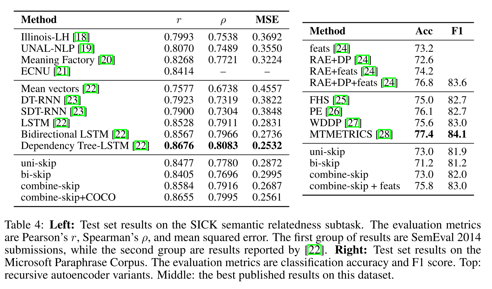

# NLP paper preview

emmmmm...站在巨人的肩膀看世界\~ 是件幸福的事情

## fasttext

结构中比较重要的几个点

### Hierarchical softmax

这个没什么好说的，和word2vec里面的是一样的。具体解释忘记之前从哪里找来得了但私以为解释的8错

> When the number of classes is large, computing the linear classifier
> is computationally expensive. More precisely, the computational
> complexity is $O(k h)$ where $k$ is the number of classes and $h$ the
> dimension of the text representation. In order to improve our running
> time, we use a hierarchical softmax (Goodman, 2001) based on the
> Huffman coding tree (Mikolov et al., 2013 ). During training, the
> computational complexity drops to $O\left(h \log _{2}(k)\right)$. The
> hierarchical softmax is also advantageous at test time when searching
> for the most likely class. Each node is associated with a probability
> that is the probability of the path from the root to that node. If the
> node is at depth $l+1$ with parents $n_{1}, \ldots, n_{l},$ its
> probability is $$
> P\left(n_{l+1}\right)=\prod_{i=1}^{l} P\left(n_{i}\right)
> $$

> This means that the probability of a node is always lower than the one
> of its parent. Exploring the tree with a depth first search and
> tracking the maximum probability among the leaves allows us to discard
> any branch associated with a small probability. In practice, we
> observe a reduction of the complexity to
> $O\left(h \log _{2}(k)\right)$ at test time. This approach is further
> extended to compute the $T$ -top targets at the cost of $O(\log (T)),$
> using a binary heap.

主要就是利用霍夫曼树加快计算的速度

> Hierachical
> Softmax的基本思想就是首先将词典中的每个词按照词频大小构建出一棵Huffman树,
> 保证词频较大的词处于相对比较浅的层,
> 词频较低的词相应的处于Huffman树较深层的叶子节点,
> 每一个词都处于这棵Huffman树上的某个叶子节点;
> 第二，将原本的一个\|V\|分类问题变成了$\log|V|$ 次的二分类问题,
> 做法简单说来就是, 原先要计算 $P\left(w_{t} \mid c_{t}\right)$的时候,
> 因为使用的 是普通的softmax,
> 势必要求词典中的每一个词的概率大小，为了减少这一步的计算量, 在
> Hierachical Softmax中，同样是计算当前词 $w_{t}$
> 在其上下文中的概率大小，只需要把它变成在
> Huffman树中的路径预测问题就可以了，因为当前词 $w_{t}$
> 在Huffman树中对应到一条路径, 这条 路径由这棵二叉树中从根节点开始,
> 经过一系列中间的父节点, 最终到达当前这个词的叶子节点而 组成,
> 那么在每一个父节点上，都对应的是一个二分类问题（本质上就是一个LR分类器），而
> Huffman树的构造过程保证了树的深度为 $\log |V|,$
> 所以也就只需要做$\log |V|$次二分类便可以 求得
> $P\left(w_{t} \mid c_{t}\right)$ 的大小, 这相比原来\|V\|次的计算量,
> 已经大大减小了。

### N\_gram features

**这个是主要区别于word2vec的输入的部分了，为了更好的学习到上下文的语序特征**

从bag of word 变成了bag of features

> Bag of words is invariant to word order but taking explicitly this
> order into account is often computationally very expensive. Instead,
> we use a bag of n-grams as additional features to capture some partial
> information about the local word order. This is very efficient in
> practice while achieving comparable results to methods that explicitly
> use the order (Wang and Manning, 2012 ). We maintain a fast and memory
> efficient mapping of the n-grams by using the hashing trick
> (Weinberger et al., 2009 ) with the same hashing function as in
> Mikolov et al. (2011) and $10 \mathrm{M}$ bins if we only used
> bigrams, and $100 \mathrm{M}$ otherwise.

-   [ ] fasttext 文本分类的结构？

### fasttext与word2vec对比

感觉读paper的时候并没有很仔细的找出fasttext和word2vec的区别

> word2vec和GloVe都不需要人工标记的监督数据，只需要语言内部存在的监督信号即可以完成训练。而与此相对应的，fastText则是利用带有监督标记的文本分类数据完成训练，本质上没有什么特殊的，模型框架就是CBOW。

因为是训练词向量的嘛，因此只需要文本就可以了，不需要标签。

fasttext和word2vec本质无区别都是单层的神经网络，CBOW的结构，通过上下文预测当前词。
word2vec是为了得到embedding的矩阵，word2vec本质是一个词袋模型:bag of
word。

### fasttext与CBOW有两点不同

> 分别是输入数据和预测目标的不同 -
> 在输入数据上，CBOW输入的是一段区间中除去目标词之外的所有其他词的向量加和或平均，而fastText为了利用更多的语序信息，将bag-of-words变成了bag-of-features，也就是下图中的输入x不再仅仅是一个词，还可以加上bigram或者是trigram的信息等等；

``` {.r}
from gensim.models import FastText
sentences = [["你", "是", "谁"], ["我", "是", "中国人"]]

model = FastText(sentences,  size=4, window=3, min_count=1, iter=10,min_n = 3 , max_n = 6,word_ngrams = 0)
model['你']  # 词向量获得的方式
model.wv['你'] # 词向量获得的方式
```

所以在训练fasttext的词向量时候，参数word\_ngrams =
0时候，是等价于word2vec的。

> 第二个不同在于，CBOW预测目标是语境中的一个词，而fastText预测目标是当前这段输入文本的类别，正因为需要这个文本类别，因此才说fastText是一个监督模型。而相同点在于，fastText的网络结构和CBOW基本一致，同时在输出层的分类上也使用了Hierachical
> Softmax技巧来加速训练。

两者本质的不同，体现在 h-softmax的使用：

Wordvec的目的是得到词向量，该词向量 最终是在输入层得到，输出层对应的
h-softmax 也会生成一系列的向量，但最终都被抛弃，不会使用。
fasttext则充分利用了h-softmax的分类功能，遍历分类树的所有叶节点，找到概率最大的label（一个或者N个）

### 实验和结果分析

*情感分析实验*

在8个数据集上面acc对比，对比了6个模型，可以看出在绝大部分的数据集上面fasttext的acc是最好的。
加入bgram的效果要优于不加的


运行时间对比fasttext的速度绝了


对比不同模型的acc，fasttext略高


在标签预测上的测试时间，fasttext非常快


## Doc2vec

### introduction

> However, the bag-of-words (BOW) has many disadvantages. The word order
> is lost, and thus different sentences can have exactly the same
> representation, as long as the same words are used. Even though
> bag-of-n-grams considers the word order in short context, it suffers
> from data sparsity and high dimensionality. Bag-of-words and
> bagof-n-grams have very little sense about the semantics of the words
> or more formally the distances between the words. This means that
> words "powerful," "strong" and "Paris" are equally distant despite the
> fact that semantically, "powerful" should be closer to "strong" than
> "Paris."

-   词袋模型的缺点是没有考虑词序，学习不到语义；
-   bag-of-n-grams模型即使在短文本中也是存在高维稀疏问题的；
-   二者都无法学习到语义

> In this paper, we propose Paragraph Vector, an unsupervised framework
> that learns continuous distributed vector representations for pieces
> of texts. The texts can be of variable-length, ranging from sentences
> to documents. The name Paragraph Vector is to emphasize the fact that
> the method can be applied to variable-length pieces of texts, anything
> from a phrase or sentence to a large document.

DOC2vec中提出了一种句向量的思想。文本是由不同长度的句子组成的，句向量可以学习到不同长度的短语和句子的embedding

> In our model, the vector representation is trained to be useful for
> predicting words in a paragraph. More precisely, we concatenate the
> paragraph vector with several word vectors from a paragraph and
> predict the following word in the given context. Both word vectors and
> paragraph vectors are trained by the stochastic gradient descent and
> backpropagation (Rumelhart et al., 1986 ). While paragraph vectors are
> unique among paragraphs, the word vectors are shared. At prediction
> time, the paragraph vectors are inferred by fixing the word vectors
> and training the new paragraph vector until convergence.

说简单点就是在原有词向量的基础上concat上了句向量，同时学习词向量和句向量的语义。

个人感觉句向量的作用其实是增加了一个上下文的position，句向量的大小可以自定义。

Doc2vec同样具有2种结构

> The above method considers the concatenation of the paragraph vector
> with the word vectors to predict the next word in a text window.
> Another way is to ignore the context words in the input, but force the
> model to predict words randomly sampled from the paragraph in the
> output. In reality, what this means is that at each iteration of
> stochastic gradient descent, we sample a text window, then sample a
> random word from the text window and form a classification task given
> the Paragraph Vector. This technique is shown in Figure $3 .$ We name
> this version the Distributed Bag of Words version of Paragraph Vector
> (PV-DBOW), as opposed to Distributed Memory version of Paragraph
> Vector (PV-DM) in previous section.

PV-DBOW是Distributed Bag of Words version of Paragraph
Vector，和Skip-gram类似，通过文档来预测文档内的词，训练的时候，随机采样一些文本片段，然后再从这个片段中采样一个词，让PV-DBOW模型来预测这个词，以此分类任务作为训练方法，说白了本质上和Skip-gram是一样的。这个方法有个致命的弱点，就是为了获取新文档的向量，还得继续走一遍训练流程，并且由于模型主要是针对文档向量预测词向量的过程进行建模，其实很难去表征词语之间的更丰富的语义结构。


PV-DM的全称是Distributed Memory Model of Paragraph
Vectors，和CBOW类似，也是通过上下文预测下一个词，不过在输入层的时候，同时也维护了一个文档ID映射到一个向量的look-up
table，模型的目的便是将当前文档的向量以及上下文向量联合输入模型，并让模型预测下一个词，训练结束后，对于现有的文档，便可以直接通过查表的方式快速得到该文档的向量，而对于新的一篇文档，那么则需要将已有的look-up
table添加相应的列，然后重新走一遍训练流程，只不过此时固定好其他的参数，只调整look-up
table，收敛后便可以得到新文档对应的向量了。


### 实验对比

Treebank Dataset 情感分析结果对比 基本都是不同长度的句子


情感分析结果对比，段落和文章上


计算句间的距离对比


实际跑下来，Doc的效果并不如word2vec的效果好，是不是和样本数据量有关，亦或者和fasttext一样适用于英文。

-   [ ] Doc2VEC是否可以直接使用word2vec的结果？

个人人为应该可以使用，但是这里的句向量的计算的方式应该挺多的，计算出来句向量直接concat到词向量上面，理论上来说就是该篇文章的思想。

## skip-thoughts

> Using the continuity of text from books, we train an encoderdecoder
> model that tries to reconstruct the surrounding sentences of an
> encoded passage. Sentences that share semantic and syntactic
> properties are thus mapped to similar vector representations. We next
> introduce a simple vocabulary expansion method to encode words that
> were not seen as part of training, allowing us to expand our
> vocabulary to a million words.

skip-thoughts也是一种encoder-decoder结构，直接根据当前句预测上下文。

skip-gram是根据当前词预测上下文的词。目标不同。

### introduction

> In this paper we abstract away from the composition methods themselves
> and consider an alternative loss function that can be applied with any
> composition operator. We consider the following question: is there a
> task and a corresponding loss that will allow us to learn highly
> generic sentence representations? We give evidence for this by
> proposing a model for learning high-quality sentence vectors without a
> particular supervised task in mind. Using word vector learning as
> inspiration, we propose an objective function that abstracts the
> skip-gram model of [8] to the sentence level. That is, instead of
> using a word to predict its surrounding context, we instead encode a
> sentence to predict the sentences around it. Thus, any composition
> operator can be substituted as a sentence encoder and only the
> objective function becomes modified. Figure 1 illustrates the model.
> We call our model skip-thoughts and vectors induced by our model are
> called skip-thought vectors.

也是在强调直接学习句向量，根据当前的句子预测上下文的句子向量。
<eos>是每个句子的结尾


当前句$s_{i}$预测上下句$s_{i-1}$和$s_{i+1}$

### 结构

> We treat skip-thoughts in the framework of encoder-decoder models
> $1 .$ That is, an encoder maps words to a sentence vector and a
> decoder is used to generate the surrounding sentences. Encoderdecoder
> models have gained a lot of traction for neural machine translation.
> In this setting, an encoder is used to map e.g. an English sentence
> into a vector. The decoder then conditions on this vector to generate
> a translation for the source English sentence. Several choices of
> encoder-decoder pairs have been explored, including ConvNet-RNN [10],
> RNN-RNN [11] and LSTM-LSTM [12]. The source sentence representation
> can also dynamically change through the use of an attention mechanism
> [13] to take into account only the relevant words for translation at
> any given time. In our model, we use an RNN encoder with GRU [14]
> activations and an RNN decoder with a conditional GRU. This model
> combination is nearly identical to the RNN encoder-decoder of [11]
> used in neural machine translation. GRU has been shown to perform as
> well as LSTM [2] on sequence modelling tasks [14] while being
> conceptually simpler. GRU units have only 2 gates and do not require
> the use of a cell. While we use RNNs for our model, any encoder and
> decoder can be used so long as we can backpropagate through it.

常见的编码器和解码器的结构有ConvNet-RNN , RNN-RNN and LSTM-LSTM

Skip-Though模型希望通过编码中间的句子来预测其前一个句子和后一个句子，前一个句子和后一个句子分别用不同的解码器进行解码，也就是根据中间句子的句向量表示进行自回归的Decoder把句子解码出来，这借鉴了机器翻译中的思想。

使用两个独立的Decoder分别建模前一句和后一句是为了用独立的语义去编码前一句和后一句。


skip-thought模型的神经网络结构是在机器翻译中最常用的 Encoder-Decoder 结构，而在 Encoder-Decoder 架构中所使用的模型是GRU模型。因此在训练句子向量时同样要使用到词向量，编码器输出的结果为句子中最后一个词所输出的向量。
GRU对比LSTM从速度上面来说是应该是更快的，效果上来看，实际数据中差不多~

### encoder

Skip-Thought模型的编码器部分使用GRU进行Encoder, GRU中有更新门和重置门，更新门对应 $z^{t},$ 重置门对应 $r^{t}$ 。更新门用于控制前一 个时刻的信息被带入当前时刻的程度, 更新门的值越大, 说明前一时刻的信息带入当前时刻越多。重置门控制的是前一时刻有多少信息被 写入到当前时刻的候选集。

> Encoder. Let $w_{i}^{1}, \ldots, w_{i}^{N}$ be the words in sentence
> $s_{i}$ where $N$ is the number of words in the sentence. At each time
> step, the encoder produces a hidden state $\mathbf{h}_{i}^{t}$ which
> can be interpreted as the representation of the sequence
> $w_{i}^{1}, \ldots, w_{i}^{t} .$ The hidden state $\mathbf{h}_{i}^{N}$
> thus represents the full sentence. To encode a sentence, we iterate
> the following sequence of equations (dropping the subscript $i$ ):

$$
\begin{aligned}
\mathbf{r}^{t} &=\sigma\left(\mathbf{W}_{r} \mathbf{x}^{t}+\mathbf{U}_{r} \mathbf{h}^{t-1}\right) \\
\mathbf{z}^{t} &=\sigma\left(\mathbf{W}_{z} \mathbf{x}^{t}+\mathbf{U}_{z} \mathbf{h}^{t-1}\right) \\
\overline{\mathbf{h}}^{t} &=\tanh \left(\mathbf{W} \mathbf{x}^{t}+\mathbf{U}\left(\mathbf{r}^{t} \odot \mathbf{h}^{t-1}\right)\right) \\
\mathbf{h}^{t} &=\left(1-\mathbf{z}^{t}\right) \odot \mathbf{h}^{t-1}+\mathbf{z}^{t} \odot \overline{\mathbf{h}}^{t}
\end{aligned}
$$ where $\overline{\mathbf{h}}^{t}$ is the proposed state update at
time $t, \mathbf{z}^{t}$ is the update gate, $\mathbf{r}_{t}$ is the
reset gate $(\odot)$ denotes a component-wise product. Both update gates
takes values between zero and one.

encoder部分就是一个GRU的结构进行特征选择

编码器的作用：编码器的作⽤是把⼀个不定⻓的输⼊序列变换成⼀个定⻓的背景变量
c，并在该背景变量中编码输⼊序列信息。

### decoder

> Decoder. The decoder is a neural language model which conditions on
> the encoder output $\mathbf{h}_{i} .$ The computation is similar to
> that of the encoder except we introduce matrices
> $\mathbf{C}_{z}, \mathbf{C}_{r}$ and $\mathbf{C}$ that are used to
> bias the update gate, reset gate and hidden state computation by the
> sentence vector. One decoder is used for the next sentence $s_{i+1}$
> while a second decoder is used for the previous sentence $s_{i-1}$.
> Separate parameters are used for each decoder with the exception of
> the vocabulary matrix $\mathbf{V}$ which is the weight matrix
> connecting the decoder's hidden state for computing a distribution
> over words. In what follows we describe the decoder for the next
> sentence $s_{i+1}$ although an analogous computation is used for the
> previous sentence $s_{i-1}$. Let $\mathbf{h}_{i+1}^{t}$ denote the
> hidden state of the decoder at time $t .$ Decoding involves iterating
> through the following sequence of equations (dropping the subscript
> $i+1$ ):

decoder的输入是encoder的输出，两个解码器分别对当前句的上下句进行解码。
下面给出了预测 $s_{i+1}$的，预测 $s_{i-1}$同上

Decoder部分使用的同样是GRU，Decoder部分的GRU是带有条件信息的，也就是编码器得到的中间句子的编码信息$h_{i}$，从而使得Encoder部分的GRU每次都能携带中间句子的信息做出决策。


$$
\begin{aligned}
\mathbf{r}^{t} &=\sigma\left(\mathbf{W}_{r}^{d} \mathbf{x}^{t-1}+\mathbf{U}_{r}^{d} \mathbf{h}^{t-1}+\mathbf{C}_{r} \mathbf{h}_{i}\right) \\
\mathbf{z}^{t} &=\sigma\left(\mathbf{W}_{z}^{d} \mathbf{x}^{t-1}+\mathbf{U}_{z}^{d} \mathbf{h}^{t-1}+\mathbf{C}_{z} \mathbf{h}_{i}\right) \\
\overline{\mathbf{h}}^{t} &=\tanh \left(\mathbf{W}^{d} \mathbf{x}^{t-1}+\mathbf{U}^{d}\left(\mathbf{r}^{t} \odot \mathbf{h}^{t-1}\right)+\mathbf{C h}_{i}\right) \\
\mathbf{h}_{i+1}^{t} &=\left(1-\mathbf{z}^{t}\right) \odot \mathbf{h}^{t-1}+\mathbf{z}^{t} \odot \overline{\mathbf{h}}^{t}
\end{aligned}
$$

Given $\mathbf{h}_{i+1}^{t},$ the probability of word $w_{i+1}^{t}$
given the previous $t-1$ words and the encoder vector is $$
P\left(w_{i+1}^{t} \mid w_{i+1}^{<t}, \mathbf{h}_{i}\right) \propto \exp \left(\mathbf{v}_{w_{i+1}^{t}} \mathbf{h}_{i+1}^{t}\right)
$$ where $\mathbf{v}_{w_{i+1}^{t}}$ denotes the row of $\mathbf{V}$
corresponding to the word of $w_{i+1}^{t} .$ An analogous computation is
performed for the previous sentence $s_{i-1}$.

解码器部分使用的网络结构也是GRU


### 目标函数

> Objective. Given a tuple $\left(s_{i-1}, s_{i}, s_{i+1}\right),$ the
> objective optimized is the sum of the log-probabilities for the
> forward and backward sentences conditioned on the encoder
> representation: $$
> \sum_{t} \log P\left(w_{i+1}^{t} \mid w_{i+1}^{<t}, \mathbf{h}_{i}\right)+\sum_{t} \log P\left(w_{i-1}^{t} \mid w_{i-1}^{<t}, \mathbf{h}_{i}\right)
> $$

预测上下句的损失函数之和。

### 词典的拓展

>We now describe how to expand our encoder's vocabulary to words it has not seen during training. Suppose we have a model that was trained to induce word representations, such as word2vec. Let $V_{w 2 v}$ denote the word embedding space of these word representations and let $V_{r n n}$ denote the $\mathrm{RNN}$ word embedding space. We assume the vocabulary of $\mathcal{V}_{w 2 v}$ is much larger than that of $\mathcal{V}_{r n n}$. Our goal is to construct a mapping $f: \mathcal{V}_{w 2 v} \rightarrow \mathcal{V}_{r n n}$ parameterized by a matrix $\mathbf{W}$ such that $\mathbf{v}^{\prime}=\mathbf{W} \mathbf{v}$ for $\mathbf{v} \in \mathcal{V}_{w 2 v}$ and $\mathbf{v}^{\prime} \in \mathcal{V}_{r n n} .$ Inspired by [15] , which learned linear mappings between translation word spaces, we solve an un-regularized L2 linear regression loss for the matrix $\mathbf{W}$. Thus, any word from $\mathcal{V}_{w 2 v}$ can now be mapped into $\mathcal{V}_{r n n}$ for encoding sentences. Table 3 shows examples of nearest neighbour words for queries that did not appear in our training vocabulary.

对于encoder部分，如何对词库中未出现的词进行编码。

1) 用 $V_{w 2 v}$ 表示训练的词向量空间, 用 $V_{r n n}$ 表示模型中的词向量空间，在这里 $V_{w 2 v}$ 词的数量是远远大于 $V_{r n n}$ 的。
2) 引入一个矩阵 $W$ 来构建一个映射函数: $\mathrm{f}: V_{r n n}->V_{w 2 v}$ 。使得有 $v \prime=W v,$ 其中 $v \in V_{w 2 v}, v \prime \in V_{r n n}$ 。
3) 通过映射函数就可以将任何在 $V_{w 2 v}$ 中的词映射到 $V_{r n n}$ 中。


- [ ] 从w2vec词向量的词表中做一个映射到rnn的词表上，得到一个映射的矩阵

这个是说加载预训练模型作为第一层的embedding吗？


>We note that there are alternate strategies for solving the vocabulary problem. One alternative is to initialize the RNN embedding space to that of pre-trained word vectors. This would require a more sophisticated softmax for decoding, or clipping the vocabulary of the decoder as it would be too computationally expensive to naively decode with vocabularies of hundreds of thousands of words. An alternative strategy is to avoid words altogether and train at the character level.

以词作为预训练的词向量，需要非常复杂的softmax做解码，这样计算的代码比较大，确实。。每次算词频都需要遍历整个词库，计算量很大。。很慢。
因此有了以字符为基本单位的可代替方案


这一段的意义何在？skip-thoughts中还是以词为基本做的预训练，没有用到字符啊

### 实验部分

>In our experiments, we evaluate the capability of our encoder as a generic feature extractor after training on the BookCorpus dataset. Our experimentation setup on each task is as follows:

在BookCorpus数据集上进行训练，每个任务如下

>Using the learned encoder as a feature extractor, extract skip-thought vectors for all sentences.

encoder部分：使用skip-th-vec提取所有句子特征


>If the task involves computing scores between pairs of sentences, compute component-wise features between pairs. This is described in more detail specifically for each experiment.

若需要计算两个句子之间的得分，则计算它们之间的成分特征。


>Train a linear classifier on top of the extracted features, with no additional fine-tuning or backpropagation through the skip-thoughts model.

在提取的特征上面训练一个线性的分类器，无需额外的微调和反向传播

>We restrict ourselves to linear classifiers for two reasons. The first is to directly evaluate the representation quality of the computed vectors. It is possible that additional performance gains can be made throughout our experiments with non-linear models but this falls out of scope of our goal. Furthermore, it allows us to better analyze the strengths and weaknesses of the learned representations. The second reason is that reproducibility now becomes very straightforward.

严格使用线性分类器有2个原因：

- 第一种是直接评估计算出的向量的表征能力。对非线性模型的实验，有可能获得额外的性能提高，此外能更好地分析表征学习的优缺点。
- 第二个原因是再现性变得非常直接。（这一点没有明白）


### 实验部分



左边的部门是计算相似性的实验，评价指标是皮尔森相关系数和斯皮尔曼相关系数，无监督的实验。
从结果上看skip-vec这个的结果不是最优的，属于中等偏上了。

右边的是一个二分类的实验，评价指标是ACC和F1.

还有计算句子相似语义的实验和情感分析等的实验，可以参考原文，此除略。


